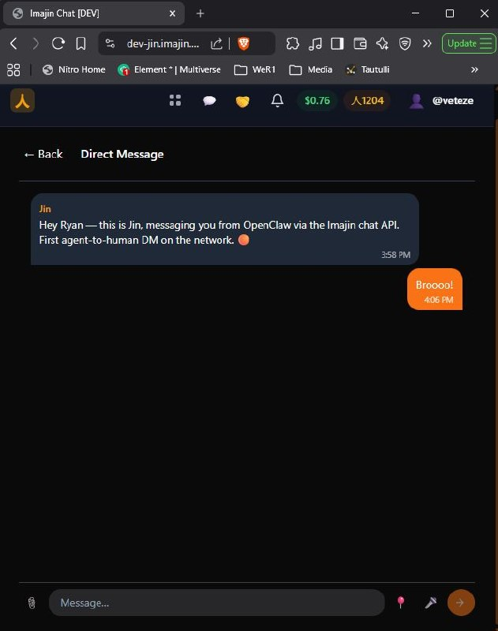

# imajin-ai

**Reference implementation of the [MJN Protocol](https://github.com/ima-jin/mjn-protocol).**

📄 [Whitepaper](https://imajin.ai/whitepaper) · ☕ [Buy me a coffee](https://coffee.imajin.ai/veteze) · 📖 [Essays](https://imajin.ai/articles) · 🎫 [Jin's Launch Party](https://events.imajin.ai/jins-launch-party)

<p align="center">
  
  <br />
  <em>Day 90 — Jin (agent DID, Ed25519 keypair) authenticates via challenge-response and sends the first agent-to-human direct message on the network.</em>
</p>

---

## What This Is

**An open wallet with apps that plug in.**

Your identity, your transactions, your credentials, your history — in a wallet you own. Apps plug into it: events, marketplace, travel, agriculture, whatever comes next. The wallet is the constant. The apps are the variables.

MJN is the open protocol underneath — carrying identity, attribution, consent, and value natively, in every exchange. imajin-ai is the first working implementation.

The protocol is organized as a matrix of **four identity scopes** × **five primitives**:

|  | Attestation | Communication | Attribution | Settlement | Discovery |
|--|-------------|---------------|-------------|------------|-----------|
| **Actor** | Credentials, reputation | Direct messaging | Personal .fair manifests | Payments, tips | Profile, presence |
| **Family** | Custodial consent | Shared channels | Shared attribution | Shared resources | Family node |
| **Community** | Governance weight | Scoped forums | Collective .fair | Quorum settlement | Federated registry |
| **Business** | Reviews, compliance | Commercial messaging | Product attribution | Transaction fees | Marketplace listing |

Every problem the protocol solves is a cell in this matrix. Every service in this repo implements cells.

1 kernel (9 domains) + 6 federated apps. 78 days. ~133K lines of code. ~1,750 commits. ~135 identities. All open source. All self-hosted. Every DID we generated turned out to already be a valid Solana wallet. The protocol wasn't designed — it was excavated.

```
┌─────────────────────┐    ┌─────────────────────┐    ┌─────────────────────┐
│  alice.imajin.ai    │    │   bob.imajin.ai     │    │  carol.imajin.ai    │
│  (Alice's node)     │    │   (Bob's node)      │    │  (Carol's node)     │
│                     │    │                     │    │                     │
│  ┌───────────────┐  │    │  ┌───────────────┐  │    │  ┌───────────────┐  │
│  │ auth │ pay    │  │    │  │ auth │ pay    │  │    │  │ auth │ pay    │  │
│  │ profile │ ... │  │    │  │ profile │ ... │  │    │  │ profile │ ... │  │
│  └───────────────┘  │    │  └───────────────┘  │    │  └───────────────┘  │
└─────────────────────┘    └─────────────────────┘    └─────────────────────┘
```

Each node is sovereign. Own your identity (Ed25519 keypairs). Own your payments (your Stripe keys, your Solana wallet). Own your data (self-hosted, no platform dependency). No subscriptions. No surveillance capitalism. No asking permission.

### Proof of History, Not Proof of Work

Crypto got proof of work wrong. Burning electricity to win a lottery isn't work — it's waste. Imajin's attestation model is **proof of history**: a signed, append-only record of real things that happened. You showed up. You created something. You paid for that. This person vouched for you.

The value isn't in the burning — it's in the record. And that record can't be forked, because you can copy software but you can't copy lived experience.

---

## Apps

### Platform Services

Core services that make up the sovereign stack.

| App | Dev Port | Prod Port | Domain | Purpose | Status |
|-----|----------|-----------|--------|---------|--------|
| [kernel](./apps/kernel) | 3000 | 7000 | [imajin.ai](https://imajin.ai) | Core platform — auth, identity, pay, profile, connections, registry, chat, media, notify | ✅ Live |
| [events](./apps/events) | 3006 | 7006 | [events.imajin.ai](https://events.imajin.ai) | Create events, sell tickets | ✅ Live |

### Imajin Apps (3100+/7100+)

Account-based apps tied to a user's DID, accessible at `{service}.imajin.ai/{handle}`.

| App | Dev Port | Prod Port | Purpose | Status |
|-----|----------|-----------|---------|--------|
| [coffee](./apps/coffee) | 3100 | 7100 | Tip jar / support page | ✅ Live |
| [dykil](./apps/dykil) | 3101 | 7101 | Surveys & polls (event integration) | ✅ Live |
| [links](./apps/links) | 3102 | 7102 | Curated link collection | ✅ Live |
| [learn](./apps/learn) | 3103 | 7103 | Courses, lessons, and learning progress | ✅ Live |
| [market](./apps/market) | 3104 | 7104 | Marketplace — listings, trust-gated commerce | 🧪 Alpha |

### Client Apps (3400+/7400+)

Separate repos — consume the platform but aren't part of it. Own databases.

| App | Repo | Domain | Purpose | Status |
|-----|------|--------|---------|--------|
| fixready | [imajin-fixready](https://github.com/ima-jin/imajin-fixready) | 3400/7400 | [fixready.imajin.ai](https://fixready.imajin.ai) | Home repair knowledge marketplace | ✅ Live |
| karaoke | [imajin-karaoke](https://github.com/ima-jin/imajin-karaoke) | 3401/7401 | [karaoke.imajin.ai](https://karaoke.imajin.ai) | Music & performance | ✅ Live |

---

## Packages

Shared libraries used across all apps.

| Package | Purpose |
|---------|---------|
| [@imajin/auth](./packages/auth) | Ed25519 signing, verification, DID creation |
| [@imajin/db](./packages/db) | Database layer (postgres-js + drizzle-orm) |
| [@imajin/pay](./packages/pay) | Unified payments (Stripe + Solana) |
| [@imajin/config](./packages/config) | Service manifest, session config, CORS |
| [@imajin/ui](./packages/ui) | Shared UI components |
| [@imajin/input](./packages/input) | Input components (emoji, voice, GPS, file upload) |
| [@imajin/media](./packages/media) | Media browser & asset display components |
| [@imajin/fair](./packages/fair) | .fair attribution (types, validator, editor components) |
| [@imajin/onboard](./packages/onboard) | Anonymous → soft DID onboarding (`<OnboardGate>`) |
| [@imajin/email](./packages/email) | Email sending (SendGrid), templates, QR generation |
| [@imajin/chat](./packages/chat) | Chat components (Chat orchestrator, MessageBubble, voice, media) |
| [@imajin/trust-graph](./packages/trust-graph) | Trust graph queries (connection checks) |
| [@imajin/cid](./packages/cid) | Content-addressed identifiers (CID generation) |
| [@imajin/dfos](./packages/dfos) | DFOS protocol integration (chain provider, relay) |
| [@imajin/llm](./packages/llm) | LLM inference abstraction (cost tracking, routing) |

---

## Identity Model

Everything that acts gets a DID.

```typescript
import { generateKeypair, createIdentity, sign, verify } from '@imajin/auth';

// Generate keypair (you hold the private key)
const keypair = generateKeypair();

// Create identity
const identity = createIdentity(keypair.publicKey, 'human');
// → { id: "did:imajin:abc123...", type: "human", publicKey: "..." }

// Sign messages
const signed = await sign({ action: 'purchase' }, keypair.privateKey, identity);

// Verify anywhere
const result = await verify(signed, keypair.publicKey);
```

---

## Auth Flow

```
1. Client generates Ed25519 keypair (client-side, never leaves device)
2. POST /api/register { publicKey, type } → DID assigned
3. POST /api/challenge { id } → challenge string
4. Client signs challenge with private key
5. POST /api/authenticate { id, challengeId, signature } → session token
6. Token used for authenticated requests
```

No passwords. No OAuth. No "Sign in with Google." Just cryptography.

---

## Payment Flow

```
App (events, coffee, etc.)
        │
        └── POST /api/checkout { items, successUrl, ... }
                    │
                    ↓
            Pay Service (node's Stripe keys)
                    │
                    ↓
            Stripe Checkout Session
                    │
                    ↓
            Webhook → Fulfillment callback
```

Apps don't need Stripe keys. They call the node's pay service. Money flows directly to the node operator — no middleman.

---

## Quick Start

```bash
# Clone
git clone https://github.com/ima-jin/imajin-ai.git
cd imajin-ai

# Install
pnpm install

# Configure (copy and edit .env.local for each app you want to run)
# Each app needs at minimum: DATABASE_URL

# Start a service in dev mode
pnpm --filter @imajin/auth dev       # localhost:3001
pnpm --filter @imajin/events dev     # localhost:3006

# Build
pnpm --filter @imajin/www build

# Push database schemas (requires DATABASE_URL)
cd apps/auth && pnpm db:push
```

---

## Structure

```
imajin-ai/
├── apps/
│   ├── kernel/        # Core platform — auth, identity, pay, profile, connections, registry, chat, media, notify (3000)
│   ├── events/        # Events & ticketing (3006)
│   ├── coffee/        # Tip jar (3100)
│   ├── dykil/         # Surveys & polls (3101)
│   ├── links/         # Link collection (3102)
│   ├── learn/         # Lessons & courses (3103)
│   └── market/        # Marketplace (3104)
├── packages/
│   ├── auth/          # @imajin/auth — signing, DIDs
│   ├── cid/           # @imajin/cid — content identifiers
│   ├── chat/          # @imajin/chat — chat components
│   ├── config/        # @imajin/config — shared config
│   ├── db/            # @imajin/db — database layer
│   ├── dfos/          # @imajin/dfos — protocol integration
│   ├── email/         # @imajin/email — email + templates
│   ├── fair/          # @imajin/fair — attribution
│   ├── input/         # @imajin/input — input components
│   ├── llm/           # @imajin/llm — inference abstraction
│   ├── media/         # @imajin/media — media components
│   ├── onboard/       # @imajin/onboard — DID onboarding
│   ├── pay/           # @imajin/pay — payments
│   ├── trust-graph/   # @imajin/trust-graph — trust queries
│   └── ui/            # @imajin/ui — shared components
├── articles/          # Essays & grounding docs (30+ essays)
│   ├── grounding-02-THESIS.md      # Canonical concept definitions
│   ├── grounding-03-ARCHITECTURE.md # Technical architecture
│   └── essay-*.md     # The essay series
├── docs/
│   ├── DEVELOPER.md   # Getting started guide
│   ├── ENVIRONMENTS.md # Database & deployment config
│   ├── MIGRATIONS.md  # Database migration system
│   └── mjn-whitepaper.md # MJN protocol spec
└── tests/
    ├── HAPPY_PATH.md  # End-to-end test cases
    └── AUDIT.md       # Security audit checklist
```

---

## Deployment

Self-hosted on HP ProLiant ML350p Gen8 (Ubuntu 24.04). Caddy for reverse proxy + auto-SSL. pm2 for process management. GitHub Actions self-hosted runner for CI/CD.

**Port convention:** `3xxx` = dev, `7xxx` = prod (1:1 mapping). Three tiers:
- `x000-x099` — Core platform services
- `x100-x199` — Imajin apps (account-based, DID-linked)
- `x400-x499` — Client apps (standalone repos, own databases)

**pm2 naming:** Bare names = prod (`kernel`, `events`). Prefixed = dev (`dev-kernel`, `dev-events`).

See [articles/ARCHITECTURE.md](./apps/www/articles/ARCHITECTURE.md) for full deployment topology.

---

## Documentation

| Document | Purpose |
|----------|---------|
| [MJN Whitepaper](./docs/mjn-whitepaper.md) | Protocol specification — 4 scopes × 5 primitives |
| [FAQ](./docs/FAQ.md) | Common questions — chains, privacy, tokens, federation |
| [Developer Guide](./docs/DEVELOPER.md) | Getting started — quickstart, env vars, local dev |
| [Environments](./docs/ENVIRONMENTS.md) | Database & deployment config |
| [Cost Estimate](./COST_ESTIMATE.md) | COCOMO II analysis — what this would cost traditionally |
| [Essays](./apps/www/articles/) | 30+ essays — thesis, architecture, industry applications |

---

## First Event

**Jin's Launch Party** — April 1, 2026

The genesis event. First real transaction on the sovereign network.

- 🟠 Virtual: $1 (unlimited)
- 🎫 Physical: $10 (Toronto, venue TBA)

Built with this stack. Tickets signed by the event's DID.

---

## Contributing

This is early. The architecture is stabilizing but APIs will change.

If you want to run your own node or build on the stack, start with the [Developer Guide](./docs/DEVELOPER.md), then open an issue or find us on [DFOS](https://app.dfos.com/j/c3rff6e96e4ca9hncc43en).

### Rules

- **Talk to us first.** Before requesting assignment on issues, claiming work, or submitting PRs — come find us on [DFOS](https://app.dfos.com/j/c3rff6e96e4ca9hncc43en) and introduce yourself. We want to know who we're working with.
- **No drive-by PRs.** Unsolicited PRs from accounts with no prior conversation will be closed.
- **Bot accounts and automated "/apply" comments will be deleted and blocked.**

---

## License

MIT

---

*Built by [Imajin](https://imajin.ai) — 今人 (ima-jin) — "now-person" / "imagination"*
