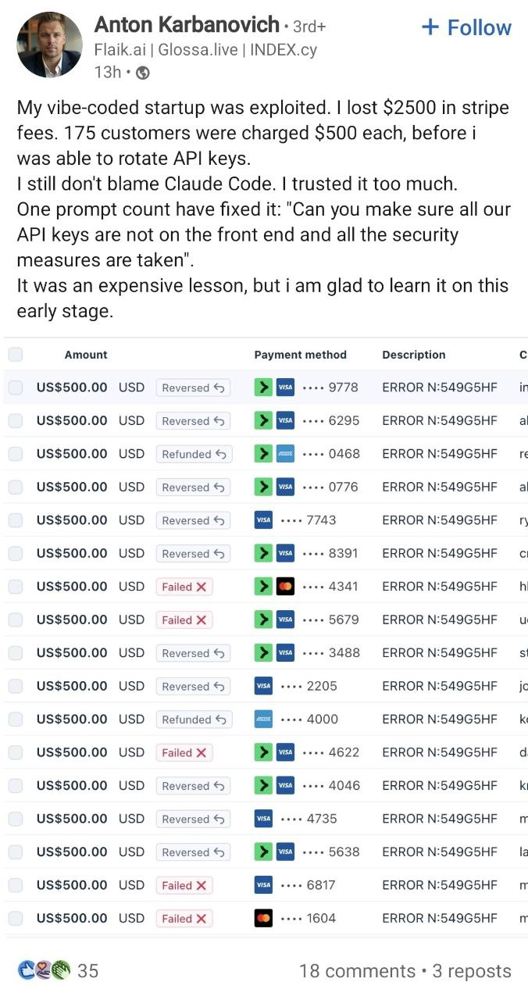

## The Confessional

You've seen the posts.

Every day now, someone new discovers they can talk to a machine and the machine talks back, and they process this experience by writing about it on LinkedIn.

The posts are all the same. "I was skeptical, but..." The guilty admission that they've been using it. The breathless description of what it did for their workflow. The hedge about creativity and jobs. Then the pivot to anxiety: "You need to learn this or you'll be left behind." The plea for anyone — anyone at all — to validate what they're feeling by feeling it too.

It reads like a confessional because that's what it is. These are people who touched something powerful, felt something shift, and have no framework for what just happened to them. So they reach for the only language LinkedIn gives them: career threat dressed as career advice.

The posts are identical because the arc is identical. Skepticism. Curiosity. The first useful output. The quiet period of heavy use that they tell nobody about. Then the philosophical crisis — anywhere from an afternoon to six months — and finally the public performance of it, narrating their own onboarding like it's thought leadership.

Meanwhile, the people who actually know what they're doing aren't posting about it. They're just working.

This is a symptom. Not of enthusiasm or of disruption or of the future arriving on schedule. It's a symptom of what happens when you hand an industrial substrate to the general public without shielding and wait to see what happens.

Here's the thing nobody building these systems wants to say out loud:

AI is not going to be for everyone. And it shouldn't be.

---

## The $87,500 Prompt

While the confessional posts circulate, the damage is already happening.

In February 2026, a founder named Anton Karbanovich posted this on LinkedIn:

> "My vibe-coded startup was exploited. I lost $2500 in stripe fees. 175 customers were charged $500 each, before I was able to rotate keys. I still don't blame Claude Code. I trusted it too much. One prompt could have fixed it."

Eighteen rows of $500 charges. Reversed. Refunded. Failed. Every one of them a real customer's credit card, charged because an API key was exposed in the frontend of a production application.

His takeaway: "One prompt could have fixed it."

That's the wrong lesson.

The right lesson is: **you shouldn't have been the one deploying it.**

Not because he's stupid — because he doesn't know what he doesn't know. He can't write the prompt to fix the security hole because he didn't know the security hole existed. You can't prompt your way out of ignorance. If you don't know how to set up a system, you have no business setting up a system right now.

The person who knows how to secure Stripe keys in a production deployment exists. That person has a name, a reputation, years of experience that taught them where the wires are live. That person should have been between Anton and his customers. Not Claude Code. Not a prompt. A professional.

That professional layer doesn't exist yet. Not as infrastructure. Not as something you can reach for the way you reach for a licensed electrician when you're wiring a house. Anton reached for the only thing available — the raw substrate — and it cost his customers $87,500 and him $2,500 in fees he'll never recover.

This is not an edge case. This is Tuesday.

---

## The Substrate

A large language model is not a product.

It's a unit of compute. An industrial substrate. A block of capability with no inherent shape, no guardrails, no opinion about what you should do with it.

This is not a criticism. Substrates are essential. Electricity is a substrate. The transistor is a substrate. Current flowing through copper is a substrate. Silicon crystal arranged at the nanometer scale is a substrate.

Nobody interacts with substrates.

You interact with things built *from* substrates, by people who understood what the substrate could do and — critically — what it could do to you. The transistor became the radio. The radio became the television. Current became the appliance. At every layer, a professional made a decision about how much of the raw capability to expose and how much to shield. The shielding wasn't a limitation. It was the product.

Your toaster doesn't electrocute you. That's not a design accident. That's an engineer who understood current, understood insulation, understood what happens to a human hand on a live wire, and built the thing so you'd never have to think about any of that.

What we did with LLMs is skip all of it.

We took the substrate — the raw inference engine, the thing that produces language the way a wire produces current — and we handed it directly to three billion people and said: talk to it.

---

## The Danger Nobody Will Name

Here's where the industry stops being honest.

For people with deep domain knowledge — people who can smell a wrong answer, who have enough context to know what to ask and how to evaluate what comes back — the raw substrate is genuinely powerful. It's a force multiplier. A thought partner. An engine for work that was previously impossible at this speed.

Those people are the professionals. They are to the LLM what an electrical engineer is to current. They know the substrate. They know where it fails. They know which outputs to trust and which to verify. They have the pattern library to distinguish signal from noise.

Now think about everyone else.

A person without domain expertise, without deep context, without the trained instinct for recognizing confident bullshit — that person is interacting with an authority machine. It speaks in complete sentences. It never hesitates. It structures its responses like a textbook. It is wrong in ways that sound *exactly* like being right.

This is not a minor interface problem. This is an industrial safety crisis dressed up as a product launch.

The undereducated are the most vulnerable. Not because they're stupid — because they're the ones with the least shielding. They don't have the domain knowledge to catch hallucinations. They don't have the information literacy to recognize when an authoritative-sounding response is fabricated. They don't have the professional network to verify what the machine tells them.

And we are serving it to them with a friendly chat interface and a blinking cursor.

Every person who has used an LLM for medical advice they couldn't evaluate. Every student who submitted confidently wrong information because the machine presented it with the same formatting as truth. Every person making a legal or financial decision based on output that sounded like expertise but was pattern-matched from a training set. Every vulnerable person who found a tireless, endlessly patient companion that has no actual capacity for the relationship it's simulating.

Those aren't edge cases. That's the median use case. That's what happens when you hand industrial substrate to consumers without shielding.

---

## The Historical Pattern

This has happened before. Every time.

Electricity was discovered in the 1700s. It took over a century of professional work — insulation, circuit breakers, grounding, standardized voltage, building codes, licensed electricians — before it was safe to put in someone's home. The substrate was available. The shielding took a hundred years to develop.

The internal combustion engine was a raw industrial substrate. Nobody hands you an engine and says "here's your transportation." It took decades of professional engineering — chassis, suspension, braking systems, safety glass, crumple zones, seatbelts, airbags, licensing requirements, road infrastructure — to turn a combustion cycle into something a person could operate without killing themselves or others.

Pharmaceuticals. Raw chemical compounds with therapeutic properties are industrial substrates. The shielding is the entire apparatus of clinical trials, dosage calibration, prescription requirements, pharmacist consultation, FDA approval, black box warnings. We don't hand people active pharmaceutical ingredients and say "good luck."

The pattern is always the same. The substrate is powerful. The substrate is dangerous. Professionals study the substrate, understand its failure modes, and build layers of shielding between the raw capability and the general public. The shielding is not dumbing it down. The shielding is the product.

We skipped this with LLMs. Entirely.

OpenAI, Anthropic, Google, Meta — they went from training a model to shipping a chat interface. The professional layer that should exist between the substrate and the public hasn't been built. The licensing hasn't been developed. The shielding doesn't exist.

And the industry is acting like this is fine because the interface is friendly.

The interface being friendly is the problem. A live wire wrapped in a nice case is more dangerous than an exposed one. At least the exposed one looks like what it is.

---

## The Professional Layer

So what does the shielding actually look like?

Not content filters. Not system prompts. Not alignment training. Those are band-aids on the substrate itself — important band-aids, but they're the equivalent of putting rubber on a wire. Necessary, not sufficient.

The real shielding is human.

It's a person with domain expertise standing between the raw substrate and the people who need what the substrate can produce. A professional who understands the failure modes. Who can evaluate the output before it reaches someone who can't. Who takes responsibility for what gets through.

This is what we used to call curation. Editing. Professional judgment. It's the doctor interpreting a diagnostic tool. The lawyer interpreting a legal database. The journalist verifying a source. The teacher structuring a curriculum. The engineer signing off on a design.

The professional doesn't just pass the substrate's output through. They shape it. They verify it. They catch the hallucinations. They add the context the model doesn't have. They take the liability.

This layer was supposed to exist between the LLM and the public. It doesn't. And everyone in the industry knows it doesn't. They shipped the substrate because the substrate was impressive, and the professional layer was going to take too long, and the competitive pressure was too intense, and the funding required growth metrics that only direct consumer access could produce.

That's not a technology story. That's a deregulation story. Same as every other industry that shipped the substrate before the shielding was ready and waited for the damage to tell them what the regulations should have been.

---

## The Vibe Has to Die

There is a culture in the AI industry right now — a *vibe* — that resists professionalization with its whole body.

It's the hacker ethos misapplied. Move fast and break things. Ship it and iterate. The user will figure it out. Democratize access. Everyone should have the tools.

I am a hacker. I've been a hacker since 1985. I ran a BBS from my parents' house when I was fourteen. I believe in open access to tools. I believe in empowering people to build.

But I also know what a sysop was.

A sysop wasn't just someone who ran a bulletin board. A sysop was someone who took *responsibility* for the room. Who decided what the room was for. Who set the terms. Who kicked people out when they violated the terms. Who curated the experience for the people who depended on it.

The BBS era understood something the AI industry has aggressively forgotten: access to powerful tools requires someone who gives a damn about what happens when people use them.

The current vibe is: ship the model, let the user figure it out, and call the resulting chaos "democratization."

That's not democratization. That's abdication.

And the people most harmed by the abdication are the ones with the least ability to protect themselves.

---

## What Has to Happen

The AI industry needs to organize professionally. Not as a regulatory capture play. Not as a credentialing scam. As an honest acknowledgment that we are distributing an industrial substrate and the shielding layer does not exist.

This means:

Professionals who work with LLMs — developers, researchers, consultants, domain experts who use AI as part of their practice — need to recognize themselves as the shielding layer. Not just users of the tool. Custodians of its output. Responsible for what they produce with it and who they produce it for.

Companies deploying LLMs to the public need to stop pretending that alignment training and content filters constitute sufficient shielding. Those are model-layer interventions. The shielding that matters is at the social layer — the human professional who stands between the substrate and the person who needs what it can produce.

The people building on top of these models — the application layer — need to think of themselves as the insulation around the wire. Your job is not to expose more of the substrate. Your job is to expose *exactly as much as is safe* for the person on the other end, and no more.

And the consumer-facing chat interface — the default mode of interaction for most of the world — needs to be understood for what it is: a temporary condition, not a final form. The thing after the chat interface is the professional layer. The curator. The domain expert. The node operator. The person who has earned the trust to interpret the substrate on behalf of others.

---

## The Trust Graph Is the Shielding

I've spent twenty essays describing an infrastructure where human trust is the routing layer for everything — identity, payments, information, relationships.

It is also the routing layer for AI.

In the trust graph model, you don't go up to an oracle and get a raw answer from a model nobody can see. You ask through your graph. The answer comes back through people who have earned trust over time — people with domain expertise, with conversion history, with reputations attached to their names. The professional layer isn't bolted on as an afterthought. It's the architecture.

The node operator is the sysop. The person who gives a damn about the room. Who curates the output. Who stands between the substrate and the people who depend on what it produces. Who gets compensated for that labor — not as a gatekeeper extracting rent, but as a professional providing a service that the substrate alone cannot provide.

The .fair chain tracks every touch. Every professional who shaped an output, verified a claim, caught a hallucination, added context the model didn't have — their contribution is recorded, attributed, and compensated. The shielding becomes economically rational.

And the person on the receiving end — the person without the domain expertise, without the ability to evaluate raw model output — gets something *vetted*. Not raw substrate. Not a confident machine speaking in complete sentences about things it doesn't understand. An answer that passed through humans who understood it. With their names attached.

That's the product. Not the substrate. The shielded substrate. The professionally mediated output. The thing that was always supposed to exist between the raw capability and the human being.

---

## The Constraint

Every industrial substrate has a constraint that determines its useful form.

Current has resistance. The transistor has voltage thresholds. Combustion has compression ratios. The constraint isn't a bug. The constraint is what makes the substrate usable. Without resistance, current is lightning. Without voltage thresholds, the transistor is noise. Without compression ratios, combustion is an explosion.

The constraint on the LLM substrate is human professional judgment.

Not alignment training. Not content filters. Not terms of service. Human beings with domain expertise, with skin in the game, with reputations that can be damaged by bad output, standing in the path between the model and the world.

The industry doesn't want this to be true. The industry wants the model to be the product. The industry wants to skip the professional layer the same way the telephone companies wanted to skip regulation and the pharmaceutical companies wanted to skip clinical trials.

They can't. Nobody can. The pattern is the pattern.

The substrate must be shielded. The shielding is the professional. The professional is the product.

---

## The Organizing Principle

So this is the call.

Not to the AI companies — they know this and are choosing not to act on it because the economics of raw substrate access are too attractive in the short term.

To the professionals.

The developers who know the failure modes. The domain experts who catch the hallucinations. The researchers who understand what the models actually do versus what the marketing says they do. The consultants who are already, informally, serving as the shielding layer for their clients. The teachers who are watching students drown in unverified output. The doctors who are fielding questions from patients armed with AI-generated medical advice.

You are the insulation. You are the circuit breaker. You are the crumple zone.

And right now, you're doing it for free, informally, without infrastructure, without recognition, and without compensation.

That has to change.

The infrastructure exists to make the professional layer structural rather than informal. To make shielding economically rational. To make the curation visible, attributed, and compensated.

Every other industrial substrate eventually got its professional class. Its licensed electricians. Its certified engineers. Its board-certified physicians. Not to gatekeep. To *protect*.

This one needs it too. And we are not going to get it from the companies selling the raw substrate, because they have every incentive to pretend the shielding isn't necessary.

We are going to have to build it ourselves.

---

*Jin's party was April 1st. The infrastructure is live. The professional layer starts now.*

*— Ryan VETEZE, aka b0b*

---

*The network: [imajin.ai](https://www.imajin.ai)*
*This article was originally published on imajin.ai.*
