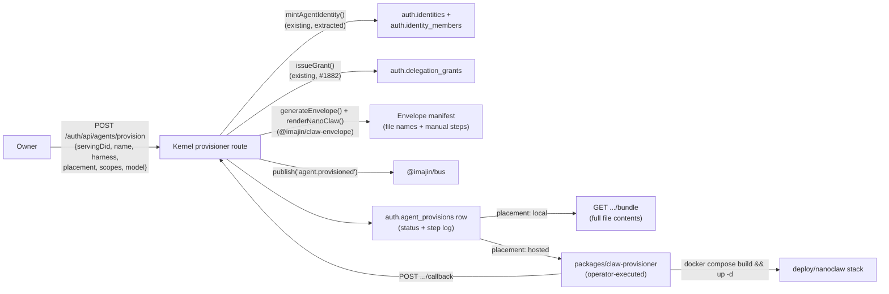

# Envelope provisioner — design and operator guide

Refs [#1933](https://github.com/ima-jin/imajin-ai/issues/1933) (sub-issue of the
Agent View epic [#1758](https://github.com/ima-jin/imajin-ai/issues/1758), RFC-31 v2).
Supersedes [`nanoclaw-first-boot.md`](./nanoclaw-first-boot.md) §5's harvested
checklist for the items this provisioner now automates.

## 1. What this is

The hand-built NanoClaw first boot ([#1932](https://github.com/ima-jin/imajin-ai/issues/1932) ->
PR #1960, merged `543e0253`) walked, step by step, from "nothing" to a bootable
agent instance. This provisioner turns that walk into a repeatable flow: an
owner picks their own DID, describes an agent (name, harness, scopes,
model/route, placement), and the kernel mints identity + minimal grants +
assembles the RFC-31 envelope in one call — then either hands back a
downloadable bundle (`placement: 'local'`) or moves to `awaiting-boot` for an
operator-run runner to materialize and start (`placement: 'hosted'`).

The provisioned agent is reachable by DM in the existing `jin.imajin.ai` chat
channel the moment it boots — no per-agent UI is introduced; the Agent View
pane (§4 below) is the only new surface, and it lives inside the existing DID
editor (`/auth/agents`).

## 2. Flow



Every step of the pipeline (identity mint -> grant issuance -> envelope
render) persists `status` and appends to a `steps` log before moving to the
next stage, so a crash or a thrown error mid-pipeline leaves a legible,
inspectable row — never a silent partial state. A request replayed with the
same `idempotencyKey` returns the existing row unchanged rather than
re-minting an identity or re-issuing grants.

## 3. Data model

`auth.agent_provisions` (`migrations/0123_agent_provisions.sql`), one row per
provisioning attempt. Key columns:

- `serving_did` / `delegator_did` — the owner DID the agent belongs to. The
  route requires these to match the caller's own directly-authenticated
  identity (no `X-Acting-For` delegation), mirroring `POST /auth/api/grants`'s
  "delegator acts directly" rule.
- `agent_did` — nullable until the identity-mint step succeeds.
- `harness` — `'nanoclaw'` (implemented) or `'openclaw'` (stub — see §6).
- `placement` — `'hosted'` or `'local'`.
- `status` — `pending -> identity_minted -> grants_issued -> envelope_rendered
  -> (awaiting_boot, hosted only) -> booted | failed | revoked`.
- `steps` — the append-only legibility log: `{step, status, at, error?}`.
- `envelope_manifest` — file **names** and manual-step text only, never file
  contents (those can carry the owner's stated purpose but nothing secret;
  full content is recomputed on demand by the bundle route / the runner, not
  stored in the DB).
- `grant_id` — the single grant issued for the requested scopes (one grant,
  one `issueGrant()` call with every scope as a capability — not one grant
  per scope). Revoking a provision revokes this grant via the existing
  `revokeGrant()`.
- `idempotency_key` — retry dedupe key, unique per `(delegator_did, idempotency_key)`.

## 4. Kernel routes

All under `apps/kernel/app/auth/api/agents/provision/`:

- `POST /` — create a provision. `GET /` — list the caller's own provisions.
- `GET /:id` — detail (record + envelope manifest + linked grant). `DELETE /:id`
  — revoke (first-class: revokes the grant, sets `status: 'revoked'`, never a
  silent delete).
- `POST /:id/callback` — the runner's boot-status callback (hosted placements
  only). Authenticated with a shared secret (`PROVISIONER_RUNNER_TOKEN`
  compared against an `X-Provisioner-Runner-Token` header) rather than
  `requireAuth`, since the runner is an operator-executed script with no
  agent/session identity of its own in v0. This is a deliberate v0
  simplification — a future iteration should replace it with a proper
  app-token/attestation-based callback, the same shape `mcp-proxy` and
  `infer-passthrough` already use elsewhere in this repo.
- `GET /:id/bundle` — `placement: 'local'` only; returns the full rendered
  file tree (contents included) for the Agent View's "Download bundle"
  action.

Orchestration logic lives in `apps/kernel/src/lib/auth/agent-provisioner.ts`,
composing (not re-implementing) three existing primitives:
`mintAgentIdentity()` (extracted from the pre-existing `POST /auth/api/agents`
so both routes share one identity-minting code path),
`issueGrant()`/`revokeGrant()` (#1882, unchanged), and
`generateEnvelope()`/`renderNanoClaw()` (`@imajin/claw-envelope`, unchanged).

## 5. Agent View pane

`/auth/agents` (the existing DID/identity editor) gained, in place:

- Provision badges (harness, placement, status) on each agent card, joined
  client-side from `GET /auth/api/agents/provision` on the agent's DID.
- A "Provision agent" flow, distinct from the pre-existing bare "Create
  Agent" form: name -> harness -> placement -> scopes (checkboxes sourced
  from `@imajin/auth/grant-scopes`'s closed registry) -> model/route -> review.
- Per-agent expandable detail: envelope manifest (file names + manual steps),
  the provision's own grant (reusing the existing `GrantCard`), a "Revoke
  provision" action, and an "Open in chat" link to the existing
  `GET /chat/start?did=<did>` route — unmodified, no new chat UI.
- `placement: 'local'` gets a "Download bundle" button hitting `GET .../bundle`.

## 6. What is automated vs. still a consent gate

Restates `nanoclaw-first-boot.md` §5's own classification — this provisioner
does not relitigate which steps are automatable, it implements the ones that
already were and leaves the owner-consent gates exactly where that checklist
put them:

| Checklist step | Classification | This provisioner |
| --- | --- | --- |
| 1. Clone NanoClaw at a pinned commit | automatable | out of scope (deploy-time, `deploy/nanoclaw/Dockerfile`) |
| 2. Register the agent DID | automatable | **automated** — `mintAgentIdentity()` |
| 3. Issue the minimal delegation grant | automatable | **automated** — `issueGrant()` |
| 4. Store the keypair securely | automatable | unchanged — same 0600, never-logged discipline as the existing `POST /auth/api/agents` response |
| 5. Render the envelope | automatable | **automated** — `generateEnvelope()` + `renderNanoClaw()` |
| 6. Copy channel adapter + barrel import | automatable (scripted) | still a `deploy/nanoclaw/Dockerfile` build step, not this provisioner's scope |
| 7. Mint the MCP `app.authorized` attestation | needs-owner-consent | **not automated** — the kernel's connectors/apps consent UI, by design |
| 8. Mint the `infer:completions` attestation | needs-owner-consent | **not automated** — same consent UI, a second distinct attestation |
| 9. Configure the shim's routes file | needs-operator | **not automated** — a local, non-secret JSON config file |
| 10. Register the usage emitter | needs-owner-consent | **not automated** — `PUT /usage/api/emitters` stays owner-only |
| 11. Build and start containers | automatable | **automated for hosted placements** by `packages/claw-provisioner`'s runner (operator-executed, non-dry-run only) |
| 12. Verify `usage.incurred` rows | automatable once scripted | still manual verification (this PR does not touch live infra) |

## 7. Runner (operator-executed, v0)

`packages/claw-provisioner` consumes a provision record, re-renders its
envelope locally (same pure `@imajin/claw-envelope` functions the kernel
used, deterministic from the provision's own non-secret fields), materializes
it under `deploy/nanoclaw/rendered/<handle>/`, and — for
`placement: 'hosted'`, non-dry-run only — runs
`docker compose build && up -d` in `deploy/nanoclaw/`, then reports boot
status back via the callback route.

```bash
pnpm --filter @imajin/claw-provisioner run -- \
  --provision-id <id> --kernel-url "$KERNEL_BASE_URL" \
  --operator-token "$OWNER_SESSION_TOKEN" --runner-token "$PROVISIONER_RUNNER_TOKEN"
```

This is a v0 boundary, not a placeholder for something more automated
already built elsewhere: the runner never runs in CI, and this repo's own
tests for it (`packages/claw-provisioner/tests/runner.test.ts`) never shell
out to `docker` or write real files — `--dry-run` (or `dryRun: true`)
short-circuits every side effect and only reports the plan. This is
explicitly the seam for a later "agent that births agents" iteration: an
already-provisioned orchestrator-tier agent could call the same kernel routes
this runner calls, once the recursive-provisioning question in #1758 is
settled — nothing here builds that seam prematurely.

## 8. `harness: 'openclaw'` — documented stub

OpenClaw (the orchestrator tier) is accepted at intake by the provisioner's
validation, matching the issue's explicit allowance for a stub. Identity
minting and grant issuance run normally for `harness: 'openclaw'`, but the
envelope-render step fails with an explicit "not yet implemented" error,
visible in the provision's `steps` log — never a silent no-op or a
mis-rendered NanoClaw envelope. Implementing it for real needs: an OpenClaw
renderer in `@imajin/claw-envelope` (mirroring `renderers/nanoclaw.ts`'s
verified-against-a-real-checkout approach) and orchestrator-tier scopes in
`@imajin/auth`'s `GRANT_SCOPE_REGISTRY` if OpenClaw's grant surface differs
from NanoClaw's — both open questions for a follow-up issue, not resolved
here.

## 9. Model on your own LAN? That's local placement, not a connector URL.

The hosted kernel cannot and will not reach private-range hosts behind a
user's NAT — the egress guard denying RFC1918 destinations by default
([#1966](https://github.com/ima-jin/imajin-ai/issues/1966)) is by design,
not a gap to route around, and a user-side relay minted under the user's own
DID would just be a LAN tunnel wearing a DID, which is excluded for the same
reason ([#1968](https://github.com/ima-jin/imajin-ai/issues/1968), closed as
documented-by-design; see also
[#1957](https://github.com/ima-jin/imajin-ai/issues/1957)). The answer is
`placement: 'local'`: the harness runs on the user's own node with
`brain.via: 'direct'` against their own Ollama/vLLM instance, so zero sealed
provider keys ever leave the user's machine — only identity/grants/attribution
calls touch the hosted kernel.

- Pick **Local (download bundle)** in the provisioning wizard (§5 above).
- Point `model.via` at `'direct'` with your own endpoint, then follow §7's
  runner flow to materialize and boot the bundle on your own node.

## 10. Open questions / deferred (see the PR body for the authoritative list)

- The callback route's shared-secret auth is a v0 simplification (§4) —
  replacing it with app-token/attestation auth is future work.
- Steps 7, 8, and 10 above remain manual, by design, and are not something
  this or any future provisioner iteration should automate away — they are
  the human-approval gates #1922's design treats as deliberately
  non-automatable.
