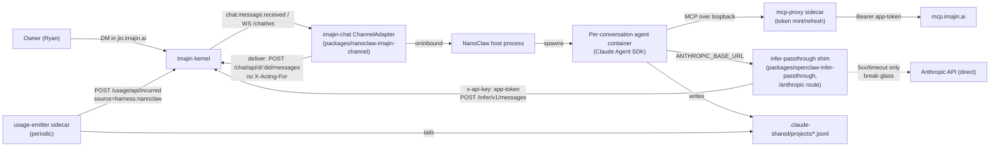

# NanoClaw first boot — design, harvested checklist, and runbook

Refs [#1932](https://github.com/ima-jin/imajin-ai/issues/1932) (this instance),
[#1933](https://github.com/ima-jin/imajin-ai/issues/1933) (the provisioner this
hand-build informs), [#1758](https://github.com/ima-jin/imajin-ai/issues/1758)
(RFC-31 v2), [#1545](https://github.com/ima-jin/imajin-ai/issues/1545)
(`onBehalfOf: self`), [#1922](https://github.com/ima-jin/imajin-ai/issues/1922) /
[#1925](https://github.com/ima-jin/imajin-ai/issues/1925) (kernel inference
passthrough), [#1957](https://github.com/ima-jin/imajin-ai/issues/1957) (local
inference connector).

## 1. Problem and scope

#1932 asks for the first hand-built NanoClaw instance living inside an Imajin
context: its own agent DID, reachable by DM at its own agent DID in `jin.imajin.ai`
through the **existing** Imajin chat channel (no new UI), tools via `mcp.imajin.ai`
under minimal grants, and per-turn usage attributed even at $0. The brain (local vs
hosted) is an explicit build decision, not the premise (the issue's 2026-09-02
re-alignment banner). This doc is the primary output the hand-build is *for*: the
harvested checklist below is what #1933's provisioner needs to automate.

**Hard rule honored throughout**: no fork of `qwibitai/nanoclaw`. Every piece below
either uses a documented NanoClaw extension seam (the channel-adapter/barrel-import
pattern every real `/add-<channel>` skill uses) or is a small sidecar process next to
it, never a patch to its source tree.

## 2. Step 0 research — how NanoClaw actually works today

Verified against a clone of `qwibitai/nanoclaw` (pushed 2026-09-02), not assumed:

- **Channels are never shipped in trunk.** `src/channels/index.ts` is a
  self-registration barrel (`import './x.js'` per channel); real channels are
  copied in by `/add-<channel>` skills from a sibling `channels` branch. A channel
  implements the `ChannelAdapter` interface (`src/channels/adapter.ts`) directly, or
  wraps a third-party `chat` SDK adapter via `createChatSdkBridge`. Imajin chat is
  neither Discord/Slack/Telegram/etc., so this instance implements `ChannelAdapter`
  directly — copied in the same way, not a fork.
- **Container boot**: `src/container-runner.ts` materializes
  `groups/<folder>/container.json` (`RunnerConfig` in
  `container/agent-runner/src/config.ts`) per agent group, mounts it read-only into
  the container at `/workspace/agent/container.json`, and the agent-runner
  (`container/agent-runner/src/index.ts`) reads `provider`, `assistantName`,
  `mcpServers`, `model`, `effort` from it. `mcpServers` entries are either
  `{ type: 'stdio', command, args, env }` or `{ type: 'http', url, headers? }` — the
  `http` shape carries only **static** headers.
- **Persona/memory surface**: NOT separate `SOUL.md`/`AGENTS.md`/`MEMORY.md` files —
  NanoClaw's real surface is one file, `groups/<folder>/instructions.prepend.md`
  (`PERSONA_PREPEND_FILE`, `src/group-persona.ts`), prepended into the composed
  `CLAUDE.md` every spawn, plus a `memory/` directory convention
  (`project-doc-compose.ts`'s `COMPOSED_HEADER`). RFC-31's envelope borrowed its
  filenames from OpenClaw's reference lump (#1758's own comment on this), not from
  NanoClaw — the two harnesses genuinely differ here, which is exactly the kind of
  seam this hand-build exists to find.
- **Brain wiring**: `container/agent-runner/src/index.ts` constructs the Claude
  provider with `env: { ...process.env }` — the FULL container process environment
  is forwarded into the `@anthropic-ai/claude-agent-sdk` `query()` call, which spawns
  the Claude Code CLI. The CLI honors the standard Anthropic env vars
  (`ANTHROPIC_API_KEY`, `ANTHROPIC_BASE_URL`) with zero NanoClaw code changes needed.
- **The wire-format gap (closed, #1959/#1961)**: the kernel's original completions
  passthrough (#1925, `POST /infer/v1/chat/completions`) was OpenAI-compatible only;
  `ANTHROPIC_BASE_URL` expects the Anthropic Messages API (`/v1/messages`) wire
  format, so the two did not interoperate at hand-build time. #1959 added a raw
  Anthropic Messages passthrough (`POST /infer/v1/messages` + `.../count_tokens`,
  app-token JWT accepted as `x-api-key`) and PR #1961 gave
  `packages/openclaw-infer-passthrough` a matching `/anthropic` shim route — see §4.
- **Identity**: the kernel already has a working agent-registration primitive,
  `POST /auth/api/agents` (`apps/kernel/app/auth/api/agents/route.ts`) — mints an
  Ed25519 keypair server-side, creates the `identities` row
  (`scope: 'actor', subtype: 'agent'`), and both `identity_members` rows (owner +
  reverse `role: 'agent'`) in one transaction. This is the existing flow Jin's own
  agent DID was registered through; this hand-build reuses it via
  `packages/claw-envelope`'s `bootstrap-identity.ts`, not a new endpoint.
- **Grants**: `POST /auth/api/grants` (#1882) issues scoped delegation from a closed
  capability registry (`@imajin/auth`'s `GRANT_SCOPE_REGISTRY` — `messages:read`,
  `messages:write`, `discovery:read`, etc.). This, not a new grant type, is what
  "minimal grants" means for this instance (#1922 finding 5: "use-not-see already
  works structurally... no new grant type is needed").
- **The reference auth pattern**: `openclaw-imajin-plugin/src/ws-service.ts` +
  `src/chat.ts` (a separate OpenClaw plugin repo) is the reference implementation for
  "speak to the kernel as an agent": Ed25519 challenge-response
  (`POST /auth/api/login/challenge` → sign → `POST /auth/api/login/verify` → session
  cookie), a persistent authenticated WS to `/chat/ws`, and
  `POST /chat/api/d/:did/messages` to send. `packages/nanoclaw-imajin-channel`
  re-implements this same protocol (a different repo/language surface, not an
  importable dependency).
- **Usage precedent**: `packages/usage-emitter-claude-code` is the exact reference
  shape #1151 wants for "external emitter, source e.g. `harness:nanoclaw`": tail
  Claude Code's own session JSONL, map `message.usage` to a `usage.incurred` row,
  POST batched to `/usage/api/incurred`, dedupe via `external_id`. NanoClaw's Claude
  provider writes the identical JSONL format under a host-bind-mounted
  `.claude-shared/projects/` directory per agent group
  (`container-runner.ts`'s `buildMounts`), so the same tailing approach applies,
  pointed at that host path.

## 3. Architecture



The envelope generator (`packages/claw-envelope`) produces the NanoClaw-side
config/workspace files and an `APPLY.md` directive doc; the identity bootstrap CLI
(same package) registers the agent DID and its minimal grant; the bridge package
(`packages/nanoclaw-imajin-channel`) is the channel adapter plus the mcp-proxy/
usage-emitter sidecars; `packages/openclaw-infer-passthrough` (an existing,
unmodified sibling package) supplies the brain-path shim; `deploy/nanoclaw/` wires
all four containers into one Compose stack.

## 4. Brain-path decision (closed — #1959/#1961)

> **Historical note.** This section originally documented a scoped-direct-key
> deviation, because at hand-build time the kernel's only completions passthrough
> (#1925) was OpenAI-compatible while NanoClaw's Claude Agent SDK/CLI speak the
> Anthropic Messages API. [#1959](https://github.com/ima-jin/imajin-ai/issues/1959)
> added a raw Anthropic Messages passthrough (`POST /infer/v1/messages` +
> `.../count_tokens`) and PR #1961 gave `packages/openclaw-infer-passthrough` a
> matching `/anthropic` shim route, closing the gap. **The deviation is closed** —
> this instance no longer runs on a direct Anthropic key by default.

**Current state**: NanoClaw's Claude Agent SDK/CLI reach Anthropic through the
`infer-passthrough` shim (`deploy/nanoclaw/infer-passthrough.Dockerfile`,
containerizing `packages/openclaw-infer-passthrough`'s own existing entry point
verbatim — no shim code was written or modified for this). The agent container's
`ANTHROPIC_BASE_URL` points at the shim's fixed `/anthropic` prefix and
`ANTHROPIC_API_KEY` is a non-secret placeholder the shim never checks; the shim
mints a kernel app-token (same `infer:completions` scope, same mint-and-refresh
discipline as the OpenAI-compatible path) and sends it as `x-api-key`. No Anthropic
key ever reaches the NanoClaw container. `packages/claw-envelope`'s
`BrainChoice.via` defaults to `'kernel-passthrough'` for exactly this reason.

The old direct-key path still exists, but only as an explicit, non-default
break-glass escape hatch (`brain.via: 'direct'`) for a deployment that deliberately
does not want to run the shim sidecar — see `deploy/nanoclaw/README.md`'s "Brain
path" section. Separately, the shim's OWN internal break-glass (kernel 5xx/timeout,
never a 4xx) falls back to a direct Anthropic key configured on the shim itself
(`ANTHROPIC_DIRECT_API_KEY`, the `"anthropic"` route's `directApiKeyEnvVar`) — that
key is never on the NanoClaw container either way.

Placement: hosted, via the kernel. Local placement (Ollama/vLLM via the #1957
local-inference connector) is a valid future swap this same envelope shape supports
without a code change — only `model.placement`/`model.provider`/`model.via` in
`packages/claw-envelope`'s `EnvelopeConfig` change.

## 5. Harvested checklist (for #1933)

Every step taken end-to-end to get from "nothing" to "bootable instance", in order.
This is the primary artifact #1933's provisioner needs — each step names its
classification and the exact kernel endpoint or CLI it maps to.

1. **Clone NanoClaw at a pinned commit.**
   Classification: automatable. Maps to: Dockerfile `ARG NANOCLAW_GIT_REF`; the
   provisioner pins and records the commit.
2. **Register the agent DID.**
   Classification: automatable. Maps to: `packages/claw-envelope`'s
   `bootstrap-identity.ts` → `POST /auth/api/agents` (existing endpoint, reused —
   mints the keypair, wires `identity_members`).
3. **Issue the minimal delegation grant.**
   Classification: automatable. Maps to: same script → `POST /auth/api/grants`
   with capabilities from `@imajin/auth`'s closed `GRANT_SCOPE_REGISTRY`.
4. **Store the returned keypair securely (0600, never logged).**
   Classification: automatable. Maps to: same script, no endpoint (local file write).
5. **Render the envelope (persona, `container.json`, env template, `APPLY.md`).**
   Classification: automatable. Maps to: `packages/claw-envelope`'s `render` CLI.
6. **Copy the channel adapter into a NanoClaw checkout + append the barrel import.**
   Classification: automatable (scripted today in `deploy/nanoclaw/Dockerfile`'s
   build stage). Maps to: no kernel endpoint — a NanoClaw-side file operation;
   #1933's provisioner should templatize this once more than one harness needs it.
7. **Mint the `app.authorized` attestation granting the mcp-proxy app DID the mcp
   scope.**
   Classification: needs-owner-consent, likely permanently. Maps to: the kernel's
   connectors/apps consent flow (no CLI shortcut exists by design — the human
   approving "this app may act for me on MCP" cannot be automated away, the same
   class of step #1922's design treats as deliberately non-automatable).
8. **Mint the `app.authorized` attestation granting the infer-passthrough shim's
   app DID (the same NanoClaw agent DID) `infer:completions` scope.** — *new step
   introduced by closing the brain-path deviation (§4).*
   Classification: needs-owner-consent, likely permanently. Maps to: the same
   connectors/apps consent flow as step 7 — a second, distinct attestation (one
   per principal/route combination, per `packages/openclaw-infer-passthrough`'s
   README) because it grants a different scope for a different purpose.
9. **Set the `"anthropic"` route's `attestationId`/`principalDid` in
   `infer-proxy-routes.json` from step 8, and its `directApiKeyEnvVar` break-glass
   key.** — *new step introduced by closing the brain-path deviation (§4).*
   Classification: needs-operator. Maps to: no kernel endpoint — a local,
   non-secret JSON config file (`deploy/nanoclaw/infer-proxy-routes.example.json`
   is the template) plus one break-glass secret env var
   (`ANTHROPIC_DIRECT_API_KEY`) on the shim container only.
10. **Register the usage emitter (`PUT /usage/api/emitters`, source
    `harness:nanoclaw`).**
    Classification: needs-owner-consent (deliberately — the emitter registry is
    owner-only by construction; a provisioner acting *as* the agent could never do
    this even if it wanted to). Maps to: `PUT /usage/api/emitters` on the kernel.
11. **Build and start the containers (`nanoclaw`, `infer-passthrough`, `mcp-proxy`,
    `usage-emitter`); verify the DM round trip.**
    Classification: automatable (`docker compose build && up`); the DM-round-trip
    verification itself is necessarily manual for a first boot (see §6), but is
    exactly the kind of check a provisioner's health surface should encode.
12. **Verify `usage.incurred` rows land from BOTH emitters** — `source:
    'inference-passthrough'` (kernel-metered, per turn) and `source:
    'harness:nanoclaw'` (the harness-side emitter, per §6's explanation of why two
    rows per turn is correct, not double-billing).
    Classification: automatable as a scripted check once both have run at least
    once; treated as manual verification here since this task does not touch live
    infra. Maps to: `GET /usage/api/rollups` (or direct `usage.incurred` row query).

**Summary for #1933**: steps 1–6, 9, 11 (build), and 12 (once scripted) are ready to
fold into the provisioner as-is. Steps 7, 8, and 10 are owner-consent gates that must
stay explicit in the provisioner's flow — closing the brain-path deviation *added* an
attestation step (8), it did not remove one. Step 9 is a policy/config step, not a
consent step, but still needs-operator until #1933 gives the provisioner a way to
write the shim's routes file itself.

**Implemented in #1933**: see [`envelope-provisioner.md`](./envelope-provisioner.md)
for the resulting kernel route, data model, operator-executed runner, and the
full per-step automated-vs-consent-gate mapping (§6 of that doc supersedes the
summary above with what actually shipped).

## 6. Runbook (operator-executed — NOT run by this task)

This task does not deploy anything or touch live infrastructure/config. The
following is for Jin/Ryan to execute on the Imajin server.

### Build

```bash
cd deploy/nanoclaw
cp .env.example .env   # fill in real values
pnpm --filter @imajin/claw-envelope render -- \
  --harness nanoclaw --agent-did <pending, see next step> \
  --owner-did <owner-did> --handle nanoclaw-poc --out ./rendered-tmp
# (agent DID isn't known until after identity registration — render again
#  once bootstrap-identity.ts has run, or pass a placeholder and re-render.)
```

### Register identity

```bash
pnpm --filter @imajin/claw-envelope bootstrap-identity -- \
  --kernel-url "$KERNEL_BASE_URL" \
  --owner-token "$OWNER_SESSION_TOKEN" \
  --handle nanoclaw-poc \
  --audience-dids "$NANOCLAW_OWNER_DID" \
  --keypair-path "$NANOCLAW_AGENT_KEYPAIR_PATH_HOST"
```

Re-run the envelope render with the real agent DID; stage its output into
`deploy/nanoclaw/rendered/` per that directory's README. Extract the keypair's
`privateKey` hex value into `NANOCLAW_AGENT_PRIVATE_KEY_HEX` in `.env` (the
infer-passthrough shim's own pre-existing config contract requires a raw env var,
not a file path — see `docker-compose.yml`'s comment on that line).

### Mint the MCP attestation (owner action, checklist step 7)

Via the connectors/apps consent flow on the kernel's own UI — no CLI shortcut exists
by design (owner-consent step).

### Mint the infer:completions attestation and configure the shim's route (owner action + operator config, checklist steps 8–9)

1. Mint a SECOND `app.authorized` attestation (same UI flow as above) granting this
   agent's app DID `infer:completions` scope — distinct from the MCP attestation,
   since it grants a different scope for a different purpose.
2. `cp deploy/nanoclaw/infer-proxy-routes.example.json deploy/nanoclaw/infer-proxy-routes.json`
   and fill in that attestation's id and the owner's principal DID on the
   `"anthropic"` entry.
3. Optionally set `DIRECT_BRAIN_API_KEY` in `.env` if the shim's own break-glass
   fallback should be live from first boot (recommended, so a kernel outage
   degrades to direct-Anthropic rather than dark).

### Register the usage emitter (owner action, checklist step 10)

```bash
curl -X PUT "$KERNEL_BASE_URL/usage/api/emitters" \
  -H "Authorization: Bearer $OWNER_SESSION_TOKEN" \
  -H "Content-Type: application/json" \
  -d '{ "source": "harness:nanoclaw", "reader": "tail-jsonl", "cadence": "periodic", "actingFor": "'"$NANOCLAW_OWNER_DID"'" }'
```

### Start

```bash
docker compose build
docker compose up -d
```

Starts all four containers: `nanoclaw`, `infer-passthrough`, `mcp-proxy`,
`usage-emitter`.

### Verify DM round trip in jin.imajin.ai

1. Open `jin.imajin.ai`, start a DM with the agent's DID.
2. Send a message; confirm a reply arrives signed by the agent DID (not the owner).
3. Check `mcp-proxy`'s `/healthz` returns `{ ok: true }`.
4. Check `infer-passthrough`'s `/healthz` returns `{ kernelOk: true, fallbackCount: 0,
   ... }` — a nonzero `fallbackCount` means traffic is currently on the shim's own
   direct-Anthropic break-glass, not the kernel.

### Verify usage.incurred rows (two rows per turn — read this before concluding something is wrong)

A single DM turn produces **two** `usage.incurred` rows, from two independent
emitters, and that is correct:

- `source: 'inference-passthrough'`, `resource: 'model:anthropic/<modelId>'` —
  written by the KERNEL itself (`recordInferenceUsage`,
  `apps/kernel/src/lib/inference/usage-ledger.ts`) the moment the infer-passthrough
  shim's `POST /infer/v1/messages` call lands. This is the kernel-metered,
  authoritative row — it is what actually gates spend caps and billing.
- `source: 'harness:nanoclaw'` — written by the `usage-emitter` sidecar tailing the
  agent container's own session JSONL (imajin-ai#1151 external-emitter pattern).
  This is a harness-side attribution row, independent of the kernel's own
  accounting — it exists so NanoClaw's own turn record is legible in the same
  ledger even for a placement (e.g. local/#1957) where the kernel never sees the
  call at all.

These are NOT double-billing: only the `inference-passthrough` row ever produces a
`pay.transactions`/`pay.balance_rollups` entry (see `usage-ledger.ts`'s division of
responsibility) — the `harness:nanoclaw` row carries no cost computation of its own
for a kernel-passthrough turn and exists purely for harness-side legibility.

```bash
curl -H "Authorization: Bearer $OWNER_SESSION_TOKEN" \
  "$KERNEL_BASE_URL/usage/api/rollups?source=inference-passthrough"
curl -H "Authorization: Bearer $OWNER_SESSION_TOKEN" \
  "$KERNEL_BASE_URL/usage/api/rollups?source=harness:nanoclaw"
```

Confirm a row appears in BOTH after a test turn, including a $0 turn (attribution is
the point, not billing — imajin-ai#1932).

### Rollback

1. `docker compose down` — stops all four containers; NanoClaw's own agent
   containers are separate and unaffected by this instance's identity.
2. Revoke the delegation grant issued in step 3 (`POST /auth/api/grants` — see the
   kernel's grants API for the revoke path) if the instance is being decommissioned,
   not just paused.
3. Revoke both `app.authorized` attestations (MCP and `infer:completions`) if
   decommissioning — leaving them in place is harmless if only pausing.
4. Set the usage emitter's `status` to `revoked` via `PUT /usage/api/emitters` if
   decommissioning.
5. The agent DID and its keypair are otherwise inert once the containers are stopped
   — no further cleanup is required to "pause" the instance. Falling back to the
   `'direct'` brain-path escape hatch (rather than decommissioning) requires no
   kernel-side change at all — see `deploy/nanoclaw/README.md`.
