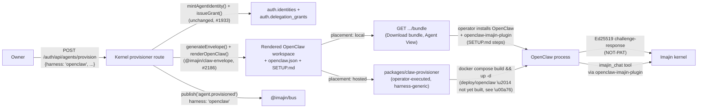

# OpenClaw first boot — design, checklist, and runbook

Refs [#2186](https://github.com/ima-jin/imajin-ai/issues/2186) (this renderer
+ runner + wizard, RFC-31 Phase 1), [#1933](https://github.com/ima-jin/imajin-ai/issues/1933)
(the envelope provisioner this reuses), [#1932](https://github.com/ima-jin/imajin-ai/issues/1932)
/ [`nanoclaw-first-boot.md`](./nanoclaw-first-boot.md) (the NanoClaw
precedent this mirrors), [#1758](https://github.com/ima-jin/imajin-ai/issues/1758)
(RFC-31 v2).

## 1. Problem and scope

`harness: 'openclaw'` was registered but unbuilt: a stub in
`packages/claw-envelope/src/cli.ts` and a comment in
`apps/kernel/src/lib/auth/agent-provisioner.ts` (both from #1933). #2186
implements the actual renderer, wires it into the kernel's provisioner and
the operator-executed runner, and enables `openclaw` in the Agent View
wizard — the same shape #1933 already shipped for `nanoclaw`, reused, not
rebuilt.

**Hard constraint honored throughout**: no new `ContextEnvelope` schema
field. `USER.md` — one of the four workspace files this issue's acceptance
criteria names — is derived entirely from existing envelope fields
(`ownerDid`, `delegationGrants`, `busRoutes`) inside the renderer itself; see
`packages/claw-envelope/src/renderers/openclaw.ts`'s module doc for the full
reasoning. No DECISION card was needed for this because the avoidance was
straightforward, not a genuine open call.

## 2. Step 0 research — how OpenClaw + its Imajin plugin actually work today

Verified against a local checkout of `openclaw-imajin-plugin` (the Imajin
channel/tool plugin FOR OpenClaw — a sibling repo, not published to npm),
NOT assumed:

- **Config shape**: `openclaw.json`'s `plugins.entries.imajin.config` takes
  `nodeUrl` (required by `openclaw.plugin.json`'s `configSchema`), `did`, and
  `keypairPath` — confirmed against both the plugin's `configSchema` and
  `index.ts`'s own module-doc example
  (`{ "nodeUrl": "https://jin.imajin.ai", "did": "did:imajin:...",
  "keypairPath": "/path/to/.jin-identity.json" }`). `keypairPath` has no
  documented env-var/SecretRef fallback in that schema (unlike
  `hookToken`/`internalApiKey`, which do) — this renderer therefore emits it
  as a literal, operator-edited placeholder path, never a template or a
  guessed real path.
- **Auth model (NOT-PAT)**: the plugin's `client.ts`/`ws-service.ts`
  authenticate via Ed25519 challenge-response
  (`POST /auth/api/login/challenge` → sign with the keypair at
  `keypairPath` → `POST /auth/api/login/verify` → session cookie), the exact
  same pattern `packages/nanoclaw-imajin-channel` already uses for NanoClaw.
  No static API key/PAT crosses the wire at any point.
- **Tool surface**: the plugin registers OpenClaw tools mapping to Imajin's
  five primitives (`imajin_identity`, `imajin_attest`, `imajin_transact`,
  `imajin_fair`, `imajin_discover`) plus `imajin_media`, `imajin_warp`,
  `imajin_infer`, `imajin_chat`, `imajin_status`, `imajin_vault` — all REST
  calls to the kernel, gated by the agent's own delegation grants
  server-side. There is no separate MCP-proxy sidecar the way NanoClaw needs
  one (`packages/nanoclaw-imajin-channel`'s `mcp-proxy`): the plugin talks to
  the kernel directly.
- **Model provider**: independent of the Imajin plugin entirely —
  `inferProxyBaseUrl` (optional, defaults to a local kernel inference proxy)
  only feeds the plugin's OWN OpenClaw model-provider registration
  (`registerImajinProvider`, its README's "Kernel brains as OpenClaw models"
  section, #36) — a separate, opt-in step from `nodeUrl`/`did`/`keypairPath`.
  This is why this renderer's `manualSteps` explicitly say "model provider is
  left to the operator" rather than wiring an `ANTHROPIC_BASE_URL`-style
  passthrough the way NanoClaw's renderer does.
- **Workspace shape**: unlike NanoClaw (whose real persona surface is one
  file, `instructions.prepend.md` — see `nanoclaw-first-boot.md` §2), RFC-31's
  own workspace vocabulary (`docs/rfcs/RFC-31-agent-execution-sandbox.md`'s
  "Workspace: The Agent IS Its Files" section) genuinely IS OpenClaw's shape:
  `AGENTS.md`, `SOUL.md`, `MEMORY.md`, `USER.md`, `memory/README.md`,
  `memory/context/*.md`. This is asserted by that RFC, not independently
  re-verified against OpenClaw's own core source in this task (see §5,
  "What could not be verified").

## 3. Architecture



The envelope generator/renderer split is identical to NanoClaw's
(`generateEnvelope()` stays harness-agnostic; `renderOpenClaw()` maps it onto
OpenClaw's shape) — see
`packages/claw-envelope/src/renderers/openclaw.ts`. The kernel route
(`apps/kernel/src/lib/auth/agent-provisioner.ts`'s `renderEnvelopeForRow`)
and the operator-executed runner
(`packages/claw-provisioner/src/runner.ts`) both select the renderer by
`row.harness`/`provision.harness` — one `if` branch each, not a rewrite.

## 4. Harvested checklist (mirrors `nanoclaw-first-boot.md` §5's shape)

1. **Install OpenClaw + place the `openclaw-imajin-plugin` package.**
   Classification: needs-operator, not automatable by this renderer — see
   §5 for why.
2. **Register the agent DID + issue the minimal delegation grant.**
   Classification: automatable, **already shipped** — reuses
   `mintAgentIdentity()`/`issueGrant()` unchanged from #1933; identical code
   path for both harnesses.
3. **Render the envelope (`AGENTS.md`/`SOUL.md`/`MEMORY.md`/`USER.md`,
   `memory/`, `openclaw.json`, `SETUP.md`).**
   Classification: automatable, **shipped this issue** —
   `renderOpenClaw()`.
4. **Place the rendered workspace files + merge `openclaw.json`'s
   `plugins.entries.imajin` block into the operator's own config, filling in
   the real `keypairPath`.**
   Classification: needs-operator — no kernel endpoint, a local file
   operation, and OpenClaw's own workspace-location/config-merge convention
   was not independently verified in this task (see §5).
5. **Start OpenClaw and verify the DM round trip.**
   Classification: automatable in principle (`openclaw config validate` +
   `openclaw gateway restart`, per the plugin's own README) but NOT run in
   this task — no OpenClaw install exists in this sandbox, and this task
   does not touch live infrastructure regardless (see §5).
6. **`agent.provisioned` bus event carries `harness: 'openclaw'`.**
   Classification: automatable, **shipped this issue** — this event is
   published from the same generic `createProvision()` code path both
   harnesses share; no harness-specific publish logic exists to get wrong.
7. **Revoke kills the agent's ability to authenticate.**
   Classification: automatable, **already shipped, harness-agnostic** —
   `revokeProvision()` revokes the issued delegation grant regardless of
   harness; a revoked grant fails the SAME Ed25519 challenge-response auth
   flow the plugin uses, whether that plugin is running against NanoClaw or
   OpenClaw. No harness-specific revoke logic exists.

## 5. What could and could not be verified in this sandbox

**Verified** (against real, locally-checked-out source — not assumed):

- `openclaw-imajin-plugin`'s `openclaw.json` config shape, its
  `configSchema`'s field list, and its Ed25519 challenge-response auth flow
  (`openclaw.plugin.json`, `index.ts`, `src/client.ts`, `src/ws-service.ts`,
  `README.md`).
- The rendered envelope's file list, `USER.md`'s real-content derivation,
  and `openclaw.json`'s shape/values — unit-tested in
  `packages/claw-envelope/tests/renderers/openclaw.test.ts`.
- The kernel provisioner pipeline (mint → grant → render → publish) for
  `harness: 'openclaw'` end-to-end at the unit level — mocked DB/identity/
  grant primitives, real `generateEnvelope()`/`renderOpenClaw()` calls — in
  `apps/kernel/src/lib/auth/__tests__/agent-provisioner.test.ts`.
- The operator-executed runner's `harness: 'openclaw'` dry-run and hosted
  code paths (render-only for local, render + compose + callback for
  hosted) — `packages/claw-provisioner/tests/runner.test.ts`. As with
  NanoClaw's runner, these tests never shell out to `docker` or write real
  files; `dryRun`/injected fakes short-circuit every side effect.
- The Agent View wizard's `openclaw` selection and submission —
  `apps/kernel/app/auth/agents/__tests__/provisioner-ui.test.tsx`.

**NOT verified** (this task's environment had no OpenClaw core-source
checkout, no OpenClaw install, no network egress to fetch one, and no live
infra to boot against — all consistent with the task's own "no deploy
actions" constraint, not a shortcut taken to save time):

- OpenClaw's own plugin-discovery mechanism (how `openclaw-imajin-plugin`'s
  `package.json`-declared `"openclaw": {"extensions": ["./index.ts"]}` is
  actually resolved — workspace-local path vs. an installed dependency vs.
  something else) on any real OpenClaw version.
- OpenClaw's own workspace-file location convention (where
  `AGENTS.md`/`SOUL.md`/etc. actually need to live on disk for a given
  agent) beyond RFC-31's own stated vocabulary.
- Whether `openclaw config validate` / `openclaw gateway restart` are the
  correct commands on the OpenClaw version an operator will actually run —
  taken directly from the plugin's own README, not independently
  cross-checked against OpenClaw core.
- An actual DM round trip against a booted OpenClaw instance authenticating
  as the minted agent DID — no OpenClaw process exists in this environment
  to boot.
- OpenClaw's real headless/gateway-mode maturity — RFC-31's own
  harness-comparison table already flags this as "no headless mode yet
  (near)"; this task did not independently confirm or update that finding.

This is why `deploy/openclaw/` ships a README explaining the gap rather than
a `Dockerfile`/`docker-compose.yml` guessed at without a real OpenClaw
checkout to verify against (see `deploy/openclaw/README.md`) — the same
verification bar `nanoclaw-first-boot.md` §2 held itself to for NanoClaw,
applied honestly to a harness this task could not clone and inspect.

## 6. Runbook (operator-executed — NOT run by this task)

### Local placement (fully supported today)

1. In the Agent View wizard (`/auth/agents`), pick `OpenClaw` as the
   harness and `Local (download bundle)` as placement, then **Provision**.
2. Click **Download bundle** on the resulting provision card.
3. Follow the bundle's own `openclaw/SETUP.md` (rendered per-agent, with the
   real agent DID and a placeholder `keypairPath` already filled in) —
   install OpenClaw + `openclaw-imajin-plugin`, place the workspace files,
   merge the `openclaw.json` config block, fill in the real keypair path,
   then `openclaw config validate && openclaw gateway restart` (or your
   OpenClaw install's equivalent).
4. Verify the DM round trip in `jin.imajin.ai`, the same check
   `nanoclaw-first-boot.md` §6 describes for NanoClaw — send a DM to the
   agent's DID, confirm a reply signed by that DID.

### Hosted placement (compose stack not yet built — see §5)

```bash
pnpm --filter @imajin/claw-provisioner run -- \
  --provision-id <id> --kernel-url "$KERNEL_BASE_URL" \
  --operator-token "$OWNER_SESSION_TOKEN" --runner-token "$PROVISIONER_RUNNER_TOKEN" \
  --compose-dir <your-openclaw-deploy-scripts>
```

Point `--compose-dir` at your own OpenClaw deployment scripts until
`deploy/openclaw/` ships a verified compose stack (tracked as a DECISION
card on this PR). The runner's render/write/callback behavior is identical
to NanoClaw's — only the compose directory and the envelope shape differ.

### Rollback

Identical to NanoClaw's (`nanoclaw-first-boot.md` §6, "Rollback"): revoking
the provision (`DELETE /auth/api/agents/provision/:id` — the Agent View's
**Revoke** button) revokes the issued delegation grant, which fails the
plugin's own Ed25519 challenge-response auth on its next attempt — this is
harness-agnostic, unchanged by this issue.
