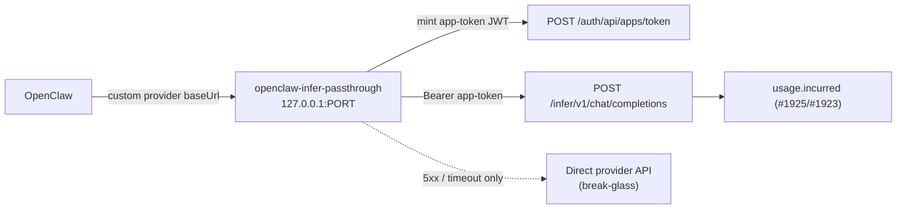
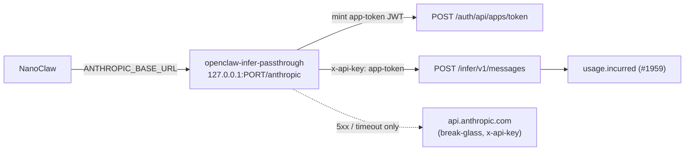

# @imajin/openclaw-infer-passthrough

Local HTTP proxy implementing [imajin-ai#1926](https://github.com/ima-jin/imajin-ai/issues/1926)
(Phase 4 of the [#1922](https://github.com/ima-jin/imajin-ai/issues/1922) inference
connectors epic): it sits between OpenClaw/NanoClaw and the kernel's completions
passthroughs so a custom-provider model (OpenAI-compatible) or an `ANTHROPIC_BASE_URL`
harness (Anthropic Messages format) can move off static gateway-config keys without the
harness itself needing to speak the kernel's short-lived app-token auth. Two wire
formats, one shim — see [imajin-ai#1959](https://github.com/ima-jin/imajin-ai/issues/1959):

- **OpenAI-compatible** (`POST /v1/chat/completions`, `POST /:providerId/v1/chat/completions`)
  — forwards to `POST /infer/v1/chat/completions` ([#1925](https://github.com/ima-jin/imajin-ai/issues/1925),
  PR [#1936](https://github.com/ima-jin/imajin-ai/pull/1936)).
- **Anthropic-format** (`POST /anthropic/v1/messages`, `POST /anthropic/v1/messages/count_tokens`)
  — forwards to `POST /infer/v1/messages` and its `count_tokens` sibling
  ([#1959](https://github.com/ima-jin/imajin-ai/issues/1959)) for harnesses that speak the
  Anthropic Messages API natively via `ANTHROPIC_BASE_URL` — today NanoClaw
  ([#1932](https://github.com/ima-jin/imajin-ai/issues/1932)), via the Claude Agent SDK /
  Claude Code CLI.

> **Scope note.** This package ships **code + the runbook below**. It does not touch any
> live gateway config — the gateway host is operated separately. The prod acceptance
> boxes in #1926 (a delegated-seat model live in prod, Anthropic passthrough proven,
> break-glass tested in prod) are the operator's to tick after rollout, using this
> runbook.

## Gap audit — 2026-09-10 scoping (#1926)

Jin's [2026-09-10 scoping comment](https://github.com/ima-jin/imajin-ai/issues/1926#issuecomment-5621228797)
narrowed #1926 to five concrete checks for the first delegated-seat model,
`gpt-6-astra` via the OpenAI connector (#1927). All five are already satisfied
by the existing, provider-agnostic implementation below — nothing about them
is OpenAI-specific, so standing up this one seat needed no new proxy or
kernel code, only the operator runbook this change adds (see "Worked example"
below) plus the routes-config/OpenClaw-config values an operator supplies.

| # | Check | Status | Where |
|---|---|---|---|
| a | Mint/refresh the 10-min app-token JWT for the AGENT DID via challenge-response with the agent's own keypair | Done | `src/token-provider.ts` (`mintAppToken`, `RouteTokenProvider`) — challenge shape matches `apps/kernel/app/auth/api/apps/token/route.ts` byte for byte; works for whichever DID is configured as `OPENCLAW_APP_DID`, including the agent's own |
| b | `/:providerId/v1/chat/completions` maps `openai` → the kernel's OpenAI connector and passes `model: gpt-6-astra` through unchanged | Done | `src/router.ts` (`resolveRoute`) + `src/upstream.ts` (`forwardToKernel`, raw byte passthrough) on this side; `apps/kernel/src/lib/inference/brain.ts`'s `openai` `BRAIN_CONNECTORS` entry (#1927) + `openai-compatible-adapter.ts` resolve and forward the sealed model kernel-side — see `tests/openai-seat.test.ts` |
| c | Streaming (SSE) works end-to-end | Done | `src/dispatch.ts`/`src/upstream.ts` (byte-for-byte body passthrough) + `src/server.ts` (`writeProxyResponse`, Node/Web stream bridge); the kernel tees the stream for metering without altering client bytes (`openai-compatible-adapter.ts`'s `meterStreamForUsage`) — see "streams an SSE response through untouched" in `tests/handle-completions.test.ts` |
| d | `usage` surfaced so the kernel meter records `usage.incurred` under the agent DID, connector=openai, model=gpt-6-astra | Done (kernel-side, #1925/#1923) | `apps/kernel/src/lib/inference/completions/openai-compatible-adapter.ts` (`recordInferenceUsage`, `agentDid: meta.agentDid`) — this proxy only forwards the `X-Session-Id`/`X-Turn-Id` headers that metadata is keyed on (`src/upstream.ts`) |
| e | Spend-cap 4xx surfaced as a clean provider error, not a hang | Done | `src/dispatch.ts` (`dispatchWithBreakGlass`: only a ≥500 status or a TTFB timeout triggers fallback; every 4xx — including the kernel's `402 spend_cap_exceeded` from `brain-http-errors.ts` — is forwarded verbatim) — see the `402` case in `tests/openai-seat.test.ts` |

No `apps/kernel` changes were needed or made for this deliverable — the
passthrough and spend-cap plumbing already generalize to every
`BRAIN_CONNECTORS` entry, OpenAI included.

## Why a proxy, not a native OpenClaw provider

OpenClaw's custom-provider mechanism (the same surface `openclaw.plugin.json` /
`extensions/imajin` and the sibling `packages/openclaw-reflex-guard` plugin build on)
speaks OpenAI-compatible HTTP to a configured `baseUrl` with a **static** bearer token.
There is no hook in the plugin API used by `packages/openclaw-reflex-guard` (or the
`openclaw-imajin-plugin` channel bridge) for a provider to mint or refresh its own
per-call credential — the lifecycle hooks that API exposes
(`message_sending`, `before_dispatch`, `before_agent_finalize`, …) are message/turn
hooks, not an auth seam a model provider can plug into. The kernel passthrough, by
design ([#1922](https://github.com/ima-jin/imajin-ai/issues/1922) finding 6), requires a
short-lived (10-minute) app-token JWT that the caller mints and refreshes itself, with
**no TTL-extension endpoint** — a deliberate, separately-reviewed decision.

Those two constraints don't have a native fit: a static bearer cannot satisfy a 10-minute
rotating credential. This package is the seam — a small local process, reachable only on
`127.0.0.1`, that OpenClaw's custom-provider `baseUrl` points at as if it *were* the
static-token upstream, while the shim does the real mint/refresh/forward against the
kernel behind it. If a future OpenClaw release adds a provider-level dynamic-auth hook,
this proxy becomes unnecessary — but as of this writing, it's the only path.

## How it works

### OpenAI-compatible path

1. OpenClaw sends an OpenAI-compatible `POST /v1/chat/completions` (or
   `POST /{providerId}/v1/chat/completions`) to this proxy.
2. The proxy resolves which **route** (provider) the request is for — either from the
   path segment or by matching `model` against the route's configured prefixes — then
   mints (or reuses a cached) kernel app-token JWT for that route via
   `POST {KERNEL_BASE_URL}/auth/api/apps/token`, and retries once with a fresh token on
   a `401`.
3. It forwards the exact request body to
   `POST {KERNEL_BASE_URL}/infer/v1/chat/completions` with that token as the bearer,
   streaming the response back byte for byte (SSE or plain JSON).
4. A kernel `5xx` or a time-to-first-byte timeout (default ~20s, configurable) triggers
   **break-glass**: the same request body is sent straight to the route's own direct
   provider endpoint using a direct API key from env. A kernel `4xx` (auth, scope,
   `422 NoModelSelected`, …) is a client error and is always forwarded verbatim — never
   triggers fallback.
5. `GET /healthz` reports `{ kernelOk, fallbackCount, fallbackRate, lastFallbackAt }` so
   an external alert can watch the fallback rate (the #1922 guardrail: "alert if
   fallback rate exceeds threshold"). Every fallback also emits a structured log line.



### Anthropic-format path (NanoClaw / Claude Code) — #1959

1. A container sets `ANTHROPIC_BASE_URL` to this shim's `/anthropic` prefix
   (`http://127.0.0.1:PORT/anthropic`) and `ANTHROPIC_API_KEY` to any placeholder value —
   the Claude Agent SDK / Claude Code CLI send that value as `x-api-key`, which this shim
   never actually checks (same "unused placeholder" contract the OpenAI-compatible path's
   `apiKey` field already has).
2. The SDK/CLI's `POST /v1/messages` and `POST /v1/messages/count_tokens` calls land on
   this shim at `POST /anthropic/v1/messages` and `POST /anthropic/v1/messages/count_tokens`.
   There is exactly one Anthropic route in the config table (`id: "anthropic"`) — unlike
   the OpenAI-compatible path, there is no per-model routing to do, since every
   `ANTHROPIC_BASE_URL` request speaks for the one sealed Anthropic connector.
3. The shim mints (or reuses) the SAME kind of kernel app-token JWT as the OpenAI-compatible
   path — same `infer:completions` scope, same mint-and-refresh discipline — but rides it
   as `x-api-key`, not `Authorization: Bearer`: the kernel's `POST /infer/v1/messages` (and
   its `count_tokens` sibling) accepts the app-token JWT in either header for exactly this
   reason (`resolveInferenceAuth`, #1959).
4. It forwards the exact request body — plus the caller's `anthropic-version`/`anthropic-beta`
   headers, unchanged — to `POST {KERNEL_BASE_URL}/infer/v1/messages` (or `.../count_tokens`),
   streaming the response back byte for byte.
5. Break-glass follows the identical rule as the OpenAI-compatible path, reusing the SAME
   `directBaseUrl`/`directApiKeyEnvVar` config fields on the `"anthropic"` route entry —
   there is no separate config surface for this wire format: a kernel `5xx`/timeout falls
   back to `{directBaseUrl}/messages` (or `.../messages/count_tokens`) with `x-api-key`
   auth; a kernel `4xx` is always forwarded verbatim.
6. `GET /healthz` reports the same shared snapshot — fallbacks from either wire format
   count toward the same `fallbackCount`/`fallbackRate`.



This closes the #1932 hand-build's documented deviation (`docs/agents/nanoclaw-first-boot.md`):
NanoClaw's Claude provider needs zero code changes to move off its scoped direct Anthropic
key — point `ANTHROPIC_BASE_URL` at this shim and `ANTHROPIC_API_KEY` at a placeholder,
using the same wiring the OpenAI-compatible path already established.

## Why the delegated app-token flow, not the service-token flow

`packages/auth/src/scope-vocabulary.ts` fences which scopes a session-less
`app-service+jwt` (`POST /auth/api/apps/token/service`, the flow
`apps/broker-agent/src/token.ts` uses) may carry — `infer:completions` is **not** in
that fence. This proxy therefore mints the user-delegated `app+jwt`
(`POST /auth/api/apps/token`), which requires an `attestationId`: the `app.authorized`
consent record the principal (Ryan) granted this app DID with `infer:completions` in
scope. The minted token's `sub` — and therefore the kernel's resolved `ownerDid` — comes
from that attestation's issuer, not from anything the proxy sends directly. One
attestation per principal/route combination.

## Configuration

### Environment variables (names only — set the values on the gateway host, never commit them)

| Variable | Required | Purpose |
|---|---|---|
| `INFER_PROXY_HOST` | no (default `127.0.0.1`) | Bind address. Keep this loopback-only. |
| `INFER_PROXY_PORT` | no (default `8787`) | Bind port. |
| `KERNEL_BASE_URL` | yes | Base URL of the kernel (e.g. `https://jin.imajin.ai`). |
| `KERNEL_TIMEOUT_MS` | no (default `20000`) | Time-to-first-byte deadline for the kernel call. |
| `DIRECT_TIMEOUT_MS` | no (default `20000`) | Time-to-first-byte deadline for a break-glass direct call. |
| `OPENCLAW_APP_DID` | yes | This app's registered DID (`registry.apps`). |
| `OPENCLAW_APP_PRIVATE_KEY` | yes | This app's Ed25519 private key (hex seed). **Never logged.** |
| `INFER_PROXY_ROUTES_CONFIG` | yes | Path to the non-secret routes JSON file (see below). |
| *(per route)* `directApiKeyEnvVar` target, e.g. `ANTHROPIC_DIRECT_API_KEY` | no | Break-glass direct provider key for that route. Omit to disable fallback for it. |

### Routes config (`INFER_PROXY_ROUTES_CONFIG`, a JSON file — no secrets)

See `config/routes.example.json`. Each entry:

```json
{
  "id": "anthropic",
  "principalDid": "did:imajin:...",
  "attestationId": "att_...",
  "modelPrefixes": ["claude-"],
  "directBaseUrl": "https://api.anthropic.com/v1",
  "directApiKeyEnvVar": "ANTHROPIC_DIRECT_API_KEY"
}
```

- `id` — also usable as a path prefix: point a custom provider's `baseUrl` at
  `http://127.0.0.1:PORT/{id}/v1` to select this route unambiguously (recommended: one
  OpenClaw custom-provider entry per upstream, matching the one-`BRAIN_CONNECTORS`-entry-
  per-provider shape from Phase 1 of the epic).
- `modelPrefixes` — fallback selection by `model` on an unprefixed
  `http://127.0.0.1:PORT/v1/chat/completions` baseUrl.
- `directBaseUrl` / `directApiKeyEnvVar` — omit both to disable break-glass fallback for
  a route (a kernel outage then surfaces the kernel's own error instead of silently
  routing around it).

### OpenClaw custom-provider config shape

```json
{
  "providers": {
    "imajin-xai": {
      "type": "openai-compatible",
      "baseUrl": "http://127.0.0.1:8787/xai/v1",
      "apiKey": "unused-placeholder",
      "models": ["grok-4", "grok-4-fast"]
    }
  }
}
```

The `apiKey` field is required by OpenClaw's schema but is never checked by this
proxy — real auth happens kernel-side via the minted app-token, not via anything
OpenClaw sends. Keep it a clearly-fake placeholder, not a real secret, in gateway
config.

### Anthropic-format (NanoClaw / Claude Code) — #1959

No new environment variables: a NanoClaw/Claude Code container reuses the SAME
`KERNEL_BASE_URL`, `OPENCLAW_APP_DID`, `OPENCLAW_APP_PRIVATE_KEY`, and
`INFER_PROXY_ROUTES_CONFIG` this shim already requires, plus the routes config's
existing `"anthropic"` entry (`directBaseUrl`/`directApiKeyEnvVar` for break-glass).
Set these two container env vars to point the harness at this shim instead of Anthropic
directly:

| Variable | Value shape |
|---|---|
| `ANTHROPIC_BASE_URL` | `http://127.0.0.1:{INFER_PROXY_PORT}/anthropic` — the shim's fixed Anthropic-format prefix. The Claude Agent SDK / Claude Code CLI append `/v1/messages` and `/v1/messages/count_tokens` themselves. |
| `ANTHROPIC_API_KEY` | Any non-empty placeholder (e.g. `unused-placeholder`) — never checked by this shim, same contract as the OpenAI-compatible path's `apiKey` field above. Real auth happens kernel-side via the minted app-token, sent as `x-api-key`. |

```env
ANTHROPIC_BASE_URL=http://127.0.0.1:8787/anthropic
ANTHROPIC_API_KEY=unused-placeholder
```

This is the exact follow-up #1932's `docs/agents/nanoclaw-first-boot.md` deviation
calls for: swap those two lines in for the scoped direct Anthropic key, no other
container or code change, and the deployment is off the direct-key deviation.

## Migration runbook

> **Order correction.** #1926's original body said "Anthropic first among hosted
> providers." That was superseded on 2026-09-01 (see the epic, #1922, and #1926's own
> pinned comment): the actual decided order is **Grok (xAI) → OpenAI → Gemini → Kimi
> (Moonshot) first, Anthropic LAST**, each flip independently revertable. This runbook
> follows the corrected, current order.

For each provider, in this order:

1. **Delegated-seat models first** (validation/coding/research — cheapest to test,
   lowest blast radius), starting with **Grok (xAI)**, then **OpenAI**, then
   **Gemini**, then **Moonshot/Kimi** (OpenClaw's live coding-agent workhorse today —
   moving its recurring spend onto a sealed credential is worth doing before the
   lower-priority Z.ai/GLM entry).
2. **Anthropic (main-session model) migrates LAST**, once the pattern has soaked on the
   others. Keep the **direct Anthropic key retained in gateway config as break-glass**
   (`directApiKeyEnvVar` pointed at it) even after the flip — kernel down must not mean
   Jin dark.
3. **Local Ollama/vLLM stay direct**, always — no route/entry for them in this proxy at
   all; they never go through the kernel (LAN-local, avoids a circular dependency on the
   kernel to reach the kernel's own host).

Per-provider flip procedure (repeat for each provider in the order above):

1. Confirm a `kernel.connectors`/`BRAIN_CONNECTORS` entry exists for the provider
   (Phase 1 of the epic — #1924/#1927/#1930/#1931).
2. Obtain (or have the operator issue) an `app.authorized` attestation granting this
   app DID `infer:completions` on behalf of the principal who owns that provider's
   sealed key. Record the attestation id and principal DID in
   `INFER_PROXY_ROUTES_CONFIG`.
3. Set the route's `directApiKeyEnvVar` to the *existing* direct key already in gateway
   config for that provider — do not remove the direct key from gateway config yet.
4. Start (or reload) this proxy with the updated routes config.
5. Add or update the OpenClaw custom-provider entry for that model family to point
   `baseUrl` at this proxy (see shape above), leaving every other provider's entry
   untouched.
6. Send a small number of real turns through the flipped model. Verify each call was
   metered kernel-side (see below) before calling the flip validated.
7. Watch `GET /healthz` for a period; `fallbackCount`/`fallbackRate` should stay at 0
   under normal kernel health.
8. Only once the pattern is proven across the delegated-seat + hosted providers does the
   Anthropic (main-session) flip happen, with its break-glass direct key deliberately
   left in place afterward (this is the one provider that keeps a permanent, not
   soak-period-only, direct fallback).

Phase 5 (#1929, blocked until Phase 4 has soaked) is where static provider keys are
finally purged from OpenClaw's own config/.env — **not** part of this ticket.

## Worked example: the gpt-6-astra delegated seat (`imajin-openai`) — #1926 first deliverable

This is the concrete instance of the "OpenAI" flip in the runbook above — the
first seat Ryan asked to see live
([2026-09-10 scoping](https://github.com/ima-jin/imajin-ai/issues/1926#issuecomment-5621228797)).
The kernel side is already done per that comment: the OpenAI brain connector
(#1927) already has a sealed per-DID key, `openai:infer`/`openai:billing`
scopes active, a spend cap, and `gpt-6-astra` selectable and set as the sealed
default. Nothing below is OpenAI-specific code — it is the operator steps for
this one route.

### 1. Run the proxy on the gateway host

Either supervisor works; use whichever the gateway host already runs its
other services under (see `docs/ENVIRONMENTS.md`'s pm2 convention) — this
proxy does not need its own daemon-management approach.

**pm2** (matches the host's existing `dev-*`/bare-name convention):

```js
// ecosystem.config.js — add an entry alongside the host's other pm2 processes
{
  name: 'infer-passthrough', // 'dev-infer-passthrough' in dev
  cwd: '/path/to/imajin-ai',
  script: 'node_modules/.bin/tsx',
  args: 'packages/openclaw-infer-passthrough/src/server.ts',
  env_file: '/etc/imajin/infer-passthrough.env', // secrets live here, not inline — see step 2
  env: {
    INFER_PROXY_HOST: '127.0.0.1',
    INFER_PROXY_PORT: '8787',
    INFER_PROXY_ROUTES_CONFIG: '/path/to/imajin-ai/packages/openclaw-infer-passthrough/config/routes.prod.json',
  },
}
```

```bash
pm2 start ecosystem.config.js --only infer-passthrough
pm2 save
```

**systemd** (if this process runs outside pm2 — it is a plain `node`/`tsx`
process, so a unit needs nothing special beyond a normal Node service):

```ini
# /etc/systemd/system/infer-passthrough.service
[Unit]
Description=OpenClaw kernel-inference passthrough (imajin-ai#1926)
After=network-online.target

[Service]
Type=simple
WorkingDirectory=/path/to/imajin-ai
ExecStart=/usr/bin/node node_modules/.bin/tsx packages/openclaw-infer-passthrough/src/server.ts
# OPENCLAW_APP_PRIVATE_KEY and OPENAI_DIRECT_API_KEY live in this file,
# root-only-readable — never inline in the unit file itself:
EnvironmentFile=/etc/imajin/infer-passthrough.env
Restart=on-failure
RestartSec=5
User=imajin

[Install]
WantedBy=multi-user.target
```

```bash
sudo systemctl daemon-reload
sudo systemctl enable --now infer-passthrough
```

### 2. Environment values for this seat

| Variable | Value for this seat |
|---|---|
| `KERNEL_BASE_URL` | The kernel's prod **front door** origin as served by Caddy (see `docs/ENVIRONMENTS.md`), e.g. `https://jin.imajin.ai` — **never** `http://127.0.0.1:7000` or any other raw port. The raw port is bound for local/reverse-proxy use on the kernel host itself; reaching it directly skips TLS termination and Caddy's routing, and the gateway host should not need direct network access to it. |
| `OPENCLAW_APP_DID` | The agent's own registered DID (`registry.apps`) — in prod this is OpenClaw's own app identity (referred to as `@jin` in the 2026-09-10 scoping note). |
| `OPENCLAW_APP_PRIVATE_KEY` | That DID's Ed25519 private key (hex seed). **Never** commit it, echo it, or put it directly in a world-readable ecosystem/unit file — source it from the root-only secrets file referenced by `env_file`/`EnvironmentFile=` above. |
| `INFER_PROXY_ROUTES_CONFIG` | Path to a routes JSON file (not committed with real values — copy `config/routes.example.json`) containing at least the `"openai"` entry below. |

### 3. The `"openai"` routes-config entry

```json
{
  "id": "openai",
  "principalDid": "did:imajin:REPLACE_WITH_DID_THAT_SEALED_OPENAI",
  "attestationId": "REPLACE_WITH_APP_AUTHORIZED_ATTESTATION_ID",
  "modelPrefixes": ["gpt-", "o1-", "o3-"],
  "directBaseUrl": "https://api.openai.com/v1",
  "directApiKeyEnvVar": "OPENAI_DIRECT_API_KEY"
}
```

- `attestationId` must be an `app.authorized` attestation issued to
  `OPENCLAW_APP_DID`, granting `infer:completions`, whose issuer
  (`principalDid`) is the DID whose OpenAI connector card has `gpt-6-astra`
  sealed — per the 2026-09-10 finding, that is already true in prod for the
  account Jin checked. Obtain/issue it the same way as any other route
  (Migration runbook step 2 above).
- `directBaseUrl`/`directApiKeyEnvVar` are optional break-glass — omit both
  to disable direct-key fallback for this seat entirely (a kernel outage then
  surfaces the kernel's own error to OpenClaw rather than silently spending
  on an unmetered key).

### 4. The OpenClaw custom-provider config block

Add this to the gateway's `models.providers` config, alongside — not
replacing — any other providers:

```json
{
  "providers": {
    "imajin-openai": {
      "type": "openai-compatible",
      "baseUrl": "http://127.0.0.1:8787/openai/v1",
      "apiKey": "unused-placeholder",
      "models": ["gpt-6-astra"]
    }
  }
}
```

- `imajin-openai` is the provider id a `sessions_spawn(model: …)` call
  references to use this seat.
- The `/openai/v1` path segment in `baseUrl` is what selects the `"openai"`
  route entry above (`resolveRoute`, `src/router.ts`) — the recommended,
  unambiguous wiring; it does not depend on `modelPrefixes` matching.
- `apiKey` is the same "required by schema, never checked" placeholder every
  other route in this README uses — real auth is the minted app-token JWT,
  not this value. **This is the whole point: it contains no OpenAI key.**

### 5. Acceptance check

> Spawn a sub-agent on that seat, it completes a task, kernel meter shows the
> turn under the agent DID with connector=openai model=gpt-6-astra, spend cap
> enforced when set, OpenClaw config contains no OpenAI key.

How to verify each clause:

- **it completes a task** — from the OpenClaw main session, `sessions_spawn`
  a sub-agent on `imajin-openai`/`gpt-6-astra` and let it run a small real
  task to completion.
- **kernel meter shows the turn under the agent DID with connector=openai
  model=gpt-6-astra** — see "Verifying a call was metered kernel-side" below;
  the `inference.usage` row's `agentDid` is `OPENCLAW_APP_DID`, `provider` is
  `openai`, `model` is `gpt-6-astra`.
- **spend cap enforced when set** — set a low spend cap on the OpenAI
  connector card, spawn another sub-agent turn past it, and confirm the
  proxy returns the kernel's `402 spend_cap_exceeded` body verbatim (see the
  `402` case in `tests/openai-seat.test.ts` for the exact shape) rather than
  hanging or silently falling back to the direct key.
- **OpenClaw config contains no OpenAI key** — grep the gateway's config and
  env files for the shape of a real OpenAI key; the only credential present
  for this seat is the `unused-placeholder` string in step 4.

## Verifying a call was metered kernel-side

Every successful passthrough call writes one row via `recordInferenceUsage` (see
`apps/kernel/src/lib/inference/completions/openai-compatible-adapter.ts` and
`anthropic-adapter.ts`, landed in #1925/PR #1936 — plus `anthropic-messages/forward.ts`
for the `/anthropic/*` path, #1959) into the per-turn `inference.usage` ledger (naming
finalized in #1923), keyed by principal DID, agent DID, session/turn id (forwarded from
this proxy's `X-Session-Id`/`X-Turn-Id` request headers when OpenClaw/NanoClaw send
them), provider, model, and token counts. The Anthropic-format path additionally carries
`cache_creation_input_tokens`/`cache_read_input_tokens` in the row's metadata, and never
meters `POST /anthropic/v1/messages/count_tokens` calls — token counting is not a billed
Anthropic call. To confirm a specific flipped route is actually being metered:

- Query the per-connector spend burn-down
  (`GET /connections/api/connectors/:id/spend`, gated by `infer:usage-read`) for the
  principal/provider and confirm it moves after a test turn.
- Or inspect `inference.usage` rows directly for the session/turn id used in the test
  call.

A call that reaches the direct break-glass endpoint is, by construction, **not**
metered kernel-side (it never touched the kernel) — `fallbackCount` on `/healthz` is
the signal that some traffic is currently unmetered and running on the direct key.

## Rollback

Rolling a single provider back to direct is a one-line gateway-config change, same as
the flip:

1. Point that provider's OpenClaw custom-provider `baseUrl` back at the provider's own
   direct API (e.g. `https://api.x.ai/v1`) and restore its real direct API key as the
   `apiKey` field.
2. Leave this proxy running for the other, still-flipped providers — routes are
   independent; rolling one back does not affect the others.
3. No kernel-side or attestation cleanup is required to roll back: the attestation and
   route entry can stay in place for a future retry.

Break-glass fallback (5xx/timeout) is the *automatic*, per-request version of this same
rollback and requires no operator action — it already uses the direct key path this
manual rollback also uses.

## Development

```
pnpm --filter @imajin/openclaw-infer-passthrough typecheck
pnpm --filter @imajin/openclaw-infer-passthrough lint
node_modules/.bin/vitest run packages/openclaw-infer-passthrough/tests
pnpm --filter @imajin/openclaw-infer-passthrough start   # tsx src/server.ts
```
