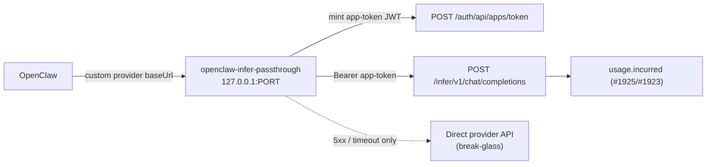

# @imajin/openclaw-infer-passthrough

Local OpenAI-compatible HTTP proxy implementing [imajin-ai#1926](https://github.com/ima-jin/imajin-ai/issues/1926)
(Phase 4 of the [#1922](https://github.com/ima-jin/imajin-ai/issues/1922) inference
connectors epic): it sits between OpenClaw and the kernel's completions passthrough
(`POST /infer/v1/chat/completions`, [#1925](https://github.com/ima-jin/imajin-ai/issues/1925),
PR [#1936](https://github.com/ima-jin/imajin-ai/pull/1936)) so OpenClaw's custom-provider
model can move off static gateway-config keys without OpenClaw itself needing to speak
the kernel's short-lived app-token auth.

> **Scope note.** This package ships **code + the runbook below**. It does not touch any
> live gateway config — the gateway host is operated separately. The prod acceptance
> boxes in #1926 (a delegated-seat model live in prod, Anthropic passthrough proven,
> break-glass tested in prod) are the operator's to tick after rollout, using this
> runbook.

## Why a proxy, not a native OpenClaw provider

OpenClaw's custom-provider mechanism (the same surface `openclaw.plugin.json` /
`extensions/imajin` and the sibling `packages/openclaw-reflex-guard` plugin build on)
speaks OpenAI-compatible HTTP to a configured `baseUrl` with a **static** bearer token.
There is no hook in the plugin API used by `packages/openclaw-reflex-guard` (or the
`openclaw-imajin-plugin` channel bridge) for a provider to mint or refresh its own
per-call credential — the lifecycle hooks that API exposes
(`message_sending`, `before_dispatch`, `before_agent_finalize`, …) are message/turn
hooks, not an auth seam a model provider can plug into. The kernel passthrough, by
design ([#1922](https://github.com/ima-jin/imajin-ai/issues/1922) finding 6), requires a
short-lived (10-minute) app-token JWT that the caller mints and refreshes itself, with
**no TTL-extension endpoint** — a deliberate, separately-reviewed decision.

Those two constraints don't have a native fit: a static bearer cannot satisfy a 10-minute
rotating credential. This package is the seam — a small local process, reachable only on
`127.0.0.1`, that OpenClaw's custom-provider `baseUrl` points at as if it *were* the
static-token upstream, while the shim does the real mint/refresh/forward against the
kernel behind it. If a future OpenClaw release adds a provider-level dynamic-auth hook,
this proxy becomes unnecessary — but as of this writing, it's the only path.

## How it works

1. OpenClaw sends an OpenAI-compatible `POST /v1/chat/completions` (or
   `POST /{providerId}/v1/chat/completions`) to this proxy.
2. The proxy resolves which **route** (provider) the request is for — either from the
   path segment or by matching `model` against the route's configured prefixes — then
   mints (or reuses a cached) kernel app-token JWT for that route via
   `POST {KERNEL_BASE_URL}/auth/api/apps/token`, and retries once with a fresh token on
   a `401`.
3. It forwards the exact request body to
   `POST {KERNEL_BASE_URL}/infer/v1/chat/completions` with that token as the bearer,
   streaming the response back byte for byte (SSE or plain JSON).
4. A kernel `5xx` or a time-to-first-byte timeout (default ~20s, configurable) triggers
   **break-glass**: the same request body is sent straight to the route's own direct
   provider endpoint using a direct API key from env. A kernel `4xx` (auth, scope,
   `422 NoModelSelected`, …) is a client error and is always forwarded verbatim — never
   triggers fallback.
5. `GET /healthz` reports `{ kernelOk, fallbackCount, fallbackRate, lastFallbackAt }` so
   an external alert can watch the fallback rate (the #1922 guardrail: "alert if
   fallback rate exceeds threshold"). Every fallback also emits a structured log line.



## Why the delegated app-token flow, not the service-token flow

`packages/auth/src/scope-vocabulary.ts` fences which scopes a session-less
`app-service+jwt` (`POST /auth/api/apps/token/service`, the flow
`apps/broker-agent/src/token.ts` uses) may carry — `infer:completions` is **not** in
that fence. This proxy therefore mints the user-delegated `app+jwt`
(`POST /auth/api/apps/token`), which requires an `attestationId`: the `app.authorized`
consent record the principal (Ryan) granted this app DID with `infer:completions` in
scope. The minted token's `sub` — and therefore the kernel's resolved `ownerDid` — comes
from that attestation's issuer, not from anything the proxy sends directly. One
attestation per principal/route combination.

## Configuration

### Environment variables (names only — set the values on the gateway host, never commit them)

| Variable | Required | Purpose |
|---|---|---|
| `INFER_PROXY_HOST` | no (default `127.0.0.1`) | Bind address. Keep this loopback-only. |
| `INFER_PROXY_PORT` | no (default `8787`) | Bind port. |
| `KERNEL_BASE_URL` | yes | Base URL of the kernel (e.g. `https://jin.imajin.ai`). |
| `KERNEL_TIMEOUT_MS` | no (default `20000`) | Time-to-first-byte deadline for the kernel call. |
| `DIRECT_TIMEOUT_MS` | no (default `20000`) | Time-to-first-byte deadline for a break-glass direct call. |
| `OPENCLAW_APP_DID` | yes | This app's registered DID (`registry.apps`). |
| `OPENCLAW_APP_PRIVATE_KEY` | yes | This app's Ed25519 private key (hex seed). **Never logged.** |
| `INFER_PROXY_ROUTES_CONFIG` | yes | Path to the non-secret routes JSON file (see below). |
| *(per route)* `directApiKeyEnvVar` target, e.g. `ANTHROPIC_DIRECT_API_KEY` | no | Break-glass direct provider key for that route. Omit to disable fallback for it. |

### Routes config (`INFER_PROXY_ROUTES_CONFIG`, a JSON file — no secrets)

See `config/routes.example.json`. Each entry:

```json
{
  "id": "anthropic",
  "principalDid": "did:imajin:...",
  "attestationId": "att_...",
  "modelPrefixes": ["claude-"],
  "directBaseUrl": "https://api.anthropic.com/v1",
  "directApiKeyEnvVar": "ANTHROPIC_DIRECT_API_KEY"
}
```

- `id` — also usable as a path prefix: point a custom provider's `baseUrl` at
  `http://127.0.0.1:PORT/{id}/v1` to select this route unambiguously (recommended: one
  OpenClaw custom-provider entry per upstream, matching the one-`BRAIN_CONNECTORS`-entry-
  per-provider shape from Phase 1 of the epic).
- `modelPrefixes` — fallback selection by `model` on an unprefixed
  `http://127.0.0.1:PORT/v1/chat/completions` baseUrl.
- `directBaseUrl` / `directApiKeyEnvVar` — omit both to disable break-glass fallback for
  a route (a kernel outage then surfaces the kernel's own error instead of silently
  routing around it).

### OpenClaw custom-provider config shape

```json
{
  "providers": {
    "imajin-xai": {
      "type": "openai-compatible",
      "baseUrl": "http://127.0.0.1:8787/xai/v1",
      "apiKey": "unused-placeholder",
      "models": ["grok-4", "grok-4-fast"]
    }
  }
}
```

The `apiKey` field is required by OpenClaw's schema but is never checked by this
proxy — real auth happens kernel-side via the minted app-token, not via anything
OpenClaw sends. Keep it a clearly-fake placeholder, not a real secret, in gateway
config.

## Migration runbook

> **Order correction.** #1926's original body said "Anthropic first among hosted
> providers." That was superseded on 2026-09-01 (see the epic, #1922, and #1926's own
> pinned comment): the actual decided order is **Grok (xAI) → OpenAI → Gemini → Kimi
> (Moonshot) first, Anthropic LAST**, each flip independently revertable. This runbook
> follows the corrected, current order.

For each provider, in this order:

1. **Delegated-seat models first** (validation/coding/research — cheapest to test,
   lowest blast radius), starting with **Grok (xAI)**, then **OpenAI**, then
   **Gemini**, then **Moonshot/Kimi** (OpenClaw's live coding-agent workhorse today —
   moving its recurring spend onto a sealed credential is worth doing before the
   lower-priority Z.ai/GLM entry).
2. **Anthropic (main-session model) migrates LAST**, once the pattern has soaked on the
   others. Keep the **direct Anthropic key retained in gateway config as break-glass**
   (`directApiKeyEnvVar` pointed at it) even after the flip — kernel down must not mean
   Jin dark.
3. **Local Ollama/vLLM stay direct**, always — no route/entry for them in this proxy at
   all; they never go through the kernel (LAN-local, avoids a circular dependency on the
   kernel to reach the kernel's own host).

Per-provider flip procedure (repeat for each provider in the order above):

1. Confirm a `kernel.connectors`/`BRAIN_CONNECTORS` entry exists for the provider
   (Phase 1 of the epic — #1924/#1927/#1930/#1931).
2. Obtain (or have the operator issue) an `app.authorized` attestation granting this
   app DID `infer:completions` on behalf of the principal who owns that provider's
   sealed key. Record the attestation id and principal DID in
   `INFER_PROXY_ROUTES_CONFIG`.
3. Set the route's `directApiKeyEnvVar` to the *existing* direct key already in gateway
   config for that provider — do not remove the direct key from gateway config yet.
4. Start (or reload) this proxy with the updated routes config.
5. Add or update the OpenClaw custom-provider entry for that model family to point
   `baseUrl` at this proxy (see shape above), leaving every other provider's entry
   untouched.
6. Send a small number of real turns through the flipped model. Verify each call was
   metered kernel-side (see below) before calling the flip validated.
7. Watch `GET /healthz` for a period; `fallbackCount`/`fallbackRate` should stay at 0
   under normal kernel health.
8. Only once the pattern is proven across the delegated-seat + hosted providers does the
   Anthropic (main-session) flip happen, with its break-glass direct key deliberately
   left in place afterward (this is the one provider that keeps a permanent, not
   soak-period-only, direct fallback).

Phase 5 (#1929, blocked until Phase 4 has soaked) is where static provider keys are
finally purged from OpenClaw's own config/.env — **not** part of this ticket.

## Verifying a call was metered kernel-side

Every successful passthrough call writes one row via `recordInferenceUsage` (see
`apps/kernel/src/lib/inference/completions/openai-compatible-adapter.ts` and
`anthropic-adapter.ts`, landed in #1925/PR #1936) into the per-turn `inference.usage`
ledger (naming finalized in #1923), keyed by principal DID, agent DID, session/turn id
(forwarded from this proxy's `X-Session-Id`/`X-Turn-Id` request headers when OpenClaw
sends them), provider, model, and token counts. To confirm a specific flipped route is
actually being metered:

- Query the per-connector spend burn-down
  (`GET /connections/api/connectors/:id/spend`, gated by `infer:usage-read`) for the
  principal/provider and confirm it moves after a test turn.
- Or inspect `inference.usage` rows directly for the session/turn id used in the test
  call.

A call that reaches the direct break-glass endpoint is, by construction, **not**
metered kernel-side (it never touched the kernel) — `fallbackCount` on `/healthz` is
the signal that some traffic is currently unmetered and running on the direct key.

## Rollback

Rolling a single provider back to direct is a one-line gateway-config change, same as
the flip:

1. Point that provider's OpenClaw custom-provider `baseUrl` back at the provider's own
   direct API (e.g. `https://api.x.ai/v1`) and restore its real direct API key as the
   `apiKey` field.
2. Leave this proxy running for the other, still-flipped providers — routes are
   independent; rolling one back does not affect the others.
3. No kernel-side or attestation cleanup is required to roll back: the attestation and
   route entry can stay in place for a future retry.

Break-glass fallback (5xx/timeout) is the *automatic*, per-request version of this same
rollback and requires no operator action — it already uses the direct key path this
manual rollback also uses.

## Development

```
pnpm --filter @imajin/openclaw-infer-passthrough typecheck
pnpm --filter @imajin/openclaw-infer-passthrough lint
node_modules/.bin/vitest run packages/openclaw-infer-passthrough/tests
pnpm --filter @imajin/openclaw-infer-passthrough start   # tsx src/server.ts
```
